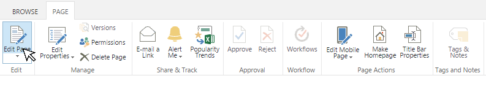
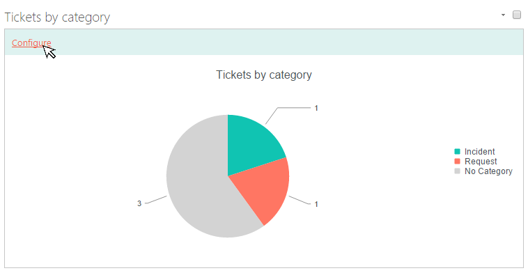
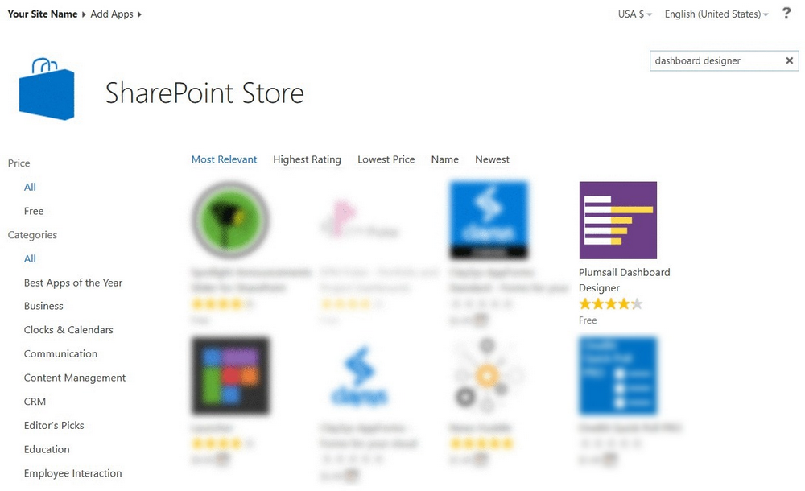
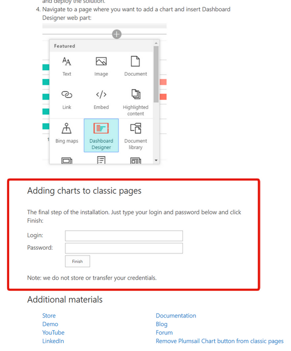

Reports customization
#####################

You can use our additional solution `Dashboard Designer`_ to customize
charts. You can find more information in the \ `documentation`_.

To install Dashboard Designer for classic pages you should install it from SharePoint store.
Please make sure that you have `Scripting Capabilities`_ turned on.

Click 'Add an app' link in the upper-right ribbon menu.
Then go to SharePoint store in the menu to the left.

Search 'Dashboard Designer' there and install it on your site:

|Install DD from SP store|

Then you should configure credentials for it.

Go to your site 'Site contents' and click on Dashboard Designer application.

Then enter your credentials in these fields:

Please keep in mind that you will need Site Owner rights.

|Configure DD|

In order to customize charts with Dashboard Designer navigate to the
page containing charts and enter edit mode.

|Start edit mode|

Clicking the link "Configure" will load Dashboard designer where you can
customize your chart.

|Edit chart|

 

 

.. _Dashboard Designer: http://www.spchart.com/
.. _documentation: http://www.spchart.com/documentation
.. _Scripting Capabilities: https://plumsail.com/docs/help-desk-o365/v1.x/Configuration%20Guide/Enabling%20scripting.html

