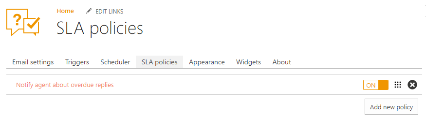
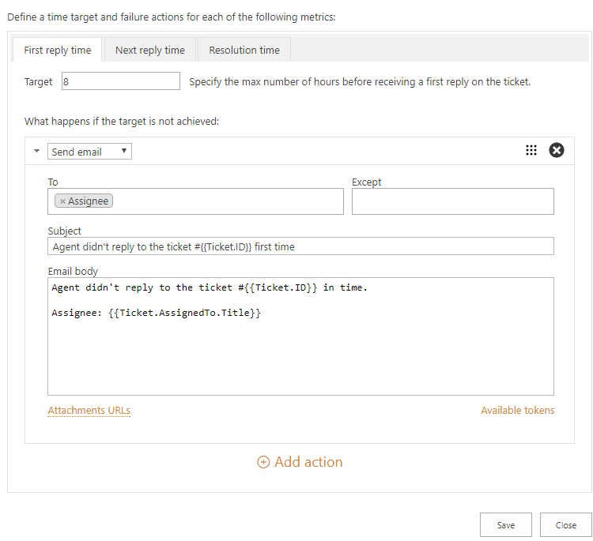
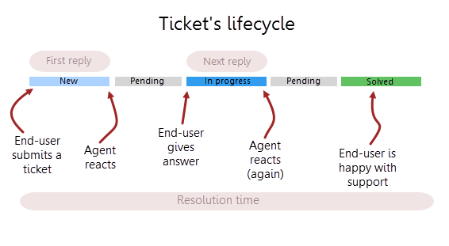
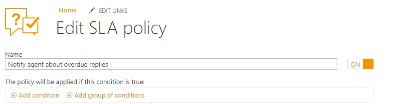
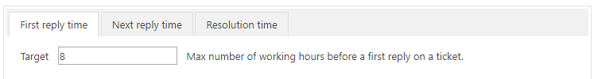
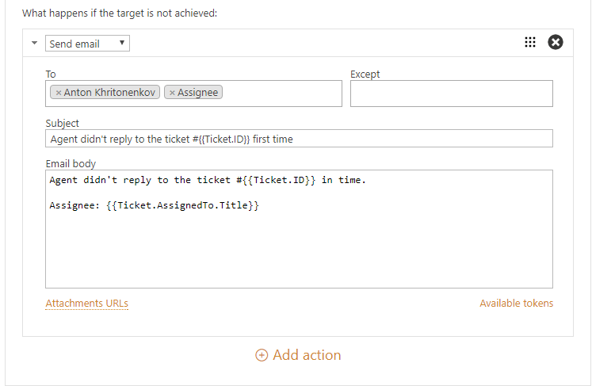

SLA policy
##########

SLA stands for Service Level Agreement, it lets you to set up an average response and resolution time. SLA helps to provide more predictable and clear service, so your customers know when to expect a response for their request. 

You can create your own SLA policies and define actions for them according to your needs.

First of all, navigate to the settings using the icon in the navbar:

|SettingsIcon|

Then click on SLA policies tab. Here you have one predefined SLA policy. By default, it’s inactive but you can activate it by switching the button on. Also, you can delete it.

.. note::

    | The list of policies is sortable and it performs on a priority basis. You can create overlapping policies but a single ticket can have only one policy applied. Order of your SLAs is important. Only the first SLA with matching condition will be applied. Put the most strict SLA rules on the top.

Let’s take a deeper look at predefined SLA policy for a better understanding of it.

|SLA|

Each SLA policy has the following structure:

.. glossary::

   Name
     SLA policy title.

   Condition. 
     Set of rules which should be satisfied to the policy be applied.

   Target
     It is a time in working hours for each metric.

   Failure actions
     It is what happens if the target is not achieved.

|SLApolicy|

In SLA you can define three metrics:

.. glossary::

    First reply time
     It is the time between ticket creation and the first response by an Assignee.
    
    Next reply time
     It is the time between the latest customer comment and the next response by Assignee.
   
    Resolution time
     It is the time taken by the ticket to move from status “New” to “Solved”.

.. note::
      | First reply time and Next reply time are using Requester comment as a starting point of SLA and these metrics are calculated only for Assignee. When resolution time is calculated, pending time is taken from it. In other words, SLA is always paused when the ticket has pending status.

|TicketLifecycle|

In predefined SLA policy, you don't have any conditions but you can configure it. `Conditions in SLA`_ are similar to trigger’s `conditions`_

|editSLA|

But for one exception — you can not set up condition based on ticket’s internal status as SLA policy already contains that.

A target is a time within which a metric should be executed. In this SLA policy Agent should answer to a ticket for a first time within 8 business hours.

|Target|

Note that only working hours are calculated for each metric. The configuration of the working hours is taken from the regional settings of the site where the helpdesk is installed. By default, it looks like this:

|WorkingHours|

You can change in Site Settings in accordance of your office hours. Site settings can be found in the top right corner of your site. Click Site Settings and navigate to Reginal settings.

If the target time is not achieved, action will be performed. Actions for SLA policies is the same to the trigger’s `actions`_.
The list of actions may contain multiple actions which will be executed sequentially one by one starting from the top. On the screenshot below, it is chosen to send an email to assignee about an unanswered ticket. Message template was supplemented by using `tokens`_.

|Failure|

.. |SettingsIcon| image:: ../_static/img/settingsicon.png
   :alt: Settings Navigation Icon

.. |WorkingHours| image:: ../_static/img/working-hours.png
   :alt: Working hours

.. _conditions: https://plumsail.com/docs/help-desk-o365/v1.x/Configuration%20Guide/Triggers.html
.. _actions: https://plumsail.com/docs/help-desk-o365/v1.x/Configuration%20Guide/Triggers.html#actions
.. _tokens: https://plumsail.com/docs/help-desk-o365/v1.x/Configuration%20Guide/Tokens%20and%20snippets.html
.. _Conditions in SLA: https://plumsail.com/docs/help-desk-o365/v1.x/Configuration%20Guide/Condition%20Syntax.html