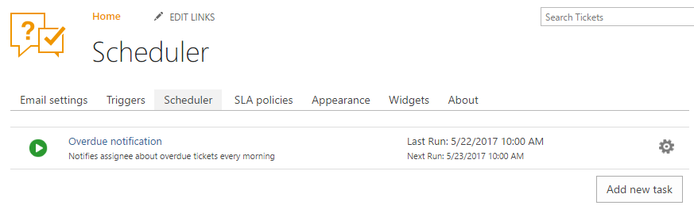
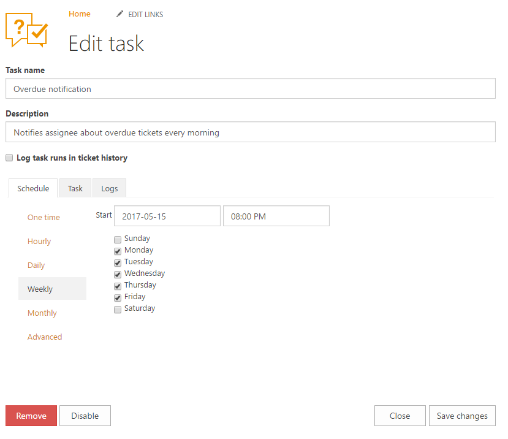
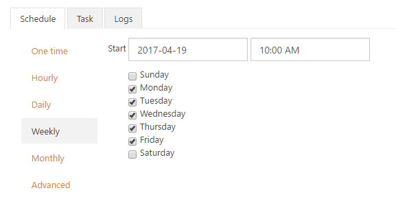
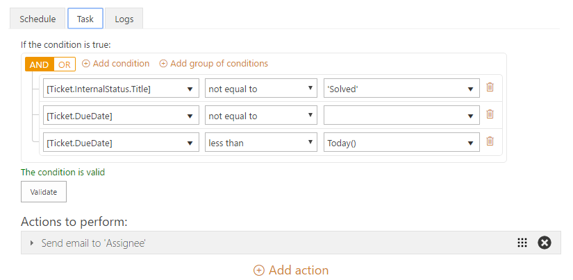
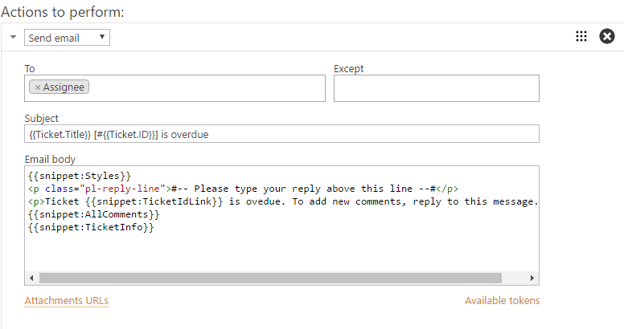
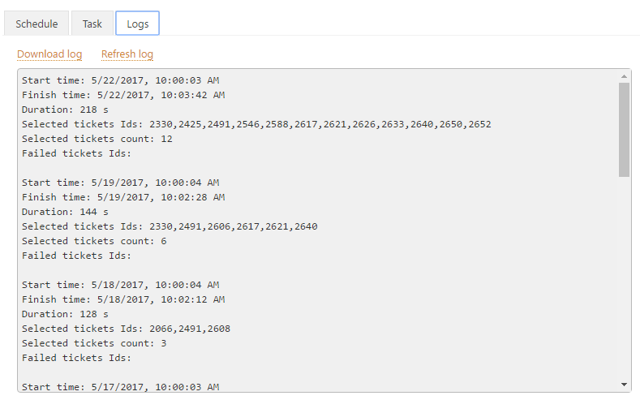

Scheduling
##########

Scheduler allows you to set up different actions on unsolved tickets which have been changed during last 30 days.

Navigate to settings using the icon in the navbar:

|SettingsIcon|

Here is the pre-defined scheduler task in HelpDesk:

|HelpDeskScheduler|

It is a task which will notify assignees about overdue tickets every morning. Let’s open this task and see what’s inside.

|TaskCondition|

Task's form fields: 
 
:Task name:  Provide a title for a task. 
:Description: Provide some information about this task.

Below we see three tabs: schedule, task, and logs.

On the schedule tab, you choose the period of time when a notification is performed. 

|Schedule|

On the second tab, you need to provide a condition for a task.

|Task|

`Condition syntax`_ and `actions`_ are exactly the same as in triggers, visit these links to learn more. 
 
The list of actions contains three types of actions: send email, start workflow and set field. One of them will be executed if the condition is "true".

|Task1|

On the logs tab you can find history on what tickets task were performed. As well, you can find this information in the ticket history if you check "Log task runs in the ticket history" option on the schedule tab.

|Logs|

Note that you can schedule a task not oftener than once in an hour.

.. _Condition syntax: https://plumsail.com/docs/help-desk-o365/v1.x/Configuration%20Guide/Condition%20Syntax.html
.. _actions: https://plumsail.com/docs/help-desk-o365/v1.x/Configuration%20Guide/Triggers.html#actions

.. |SettingsIcon| image:: ../_static/img/settingsicon.png
   :alt: Settings Navigation Icon

