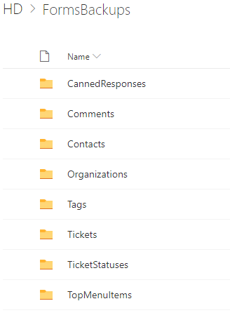
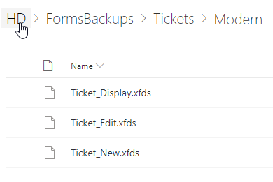

Customize ticket and contact forms
################################## 

.. note:: 

   `Plumsail Forms <https://plumsail.com/forms/>`_ is included into the "Yacht" and "Ocean liner" plans. You have to purchase it separately for the "Jet boat" plan.

   - You can customize only forms in the Tickets, Contacts, and Organizations lists by default.
   - If you want to customize other lists you need to `buy Plumsail Forms subscription <https://plumsail.com/forms/store/>`_.
   - You will see trial message in Plumsail Forms UI. It is because you don't have full subscription. You are still able to customize HelpDesk forms.
   - Do not delete default JavaScript code - just extend it in the case of need. Otherwise, you will encounter a notification in HelpDesk forms that Forms trial has expired.
   - If you are using Plumsail HelpDesk 2.1.1 and earlier, please `use this documentation instead <deprecated/Ticket%20and%20contact%20forms%20customization%20(before%202.1.1).html>`_.

.. contents:: Table of contents
    :local:
    :depth: 1

Using Plumsail Forms
-------------------

In order to customize ticket and contact forms you need to install `Plumsail Forms for SharePoint online <https://plumsail.com/forms/>`_.
It is available for free for HelpDesk customizations.
Pluimsail Forms allows you to design SharePoint forms with tabs,
complex tables, and accordions among other UI elements.

To start using Plumsail Forms, please `download <https://plumsail.com/forms/start-trial/>`_ a desktop app and run the installation file on your computer. To connect to HelpDesk, run the app, choose **SharePoint** and specify your HelpDesk site URL. You'll be prompted for your login details. Once it connects to HelpDesk, please choose a list you want to work with:

|PlumsailForms Sign in|

You can find more information on how to use Plumsail Forms in `the
documentation`_.

Create custom forms
-------------------

In order to customize a form with Plumsail Forms connect to the list
the form is based on. This will open  the form editor where you can customize your
form in a simple drag-and-drop fashion:

|Plumsail Forms Interface|

Restore previous version of Helpdesk forms
------------------------------------------

You can easily rollback any changes applied to the Helpdesk forms: restore a previous version or return to the default forms. 

You can find detailed instructions on how to do this in `this article <https://plumsail.com/docs/forms-sp/how-to/form-versions.html>`_.
 
.. _Plumsail Forms: https://plumsail.com/forms/
.. _the documentation: https://plumsail.com/docs/forms-sp/index.html

.. |HelpDeskFDRibbon| image:: ../_static/img/helpdeskfdribbon.png
   :alt: Forms Designer Ribbon
.. |PlumsailForms Sign in| image:: ../_static/img/plumsail-forms-sign-in.png
   :alt: Plumsail Forms Sign in
.. |Plumsail Forms Interface| image:: ../_static/img/plumsail-forms-interface.png
    :alt: Plumsail Forms Interface

