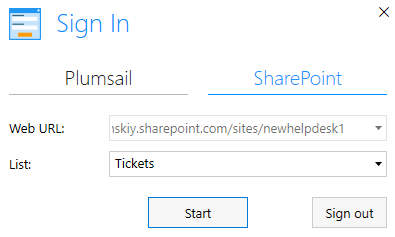
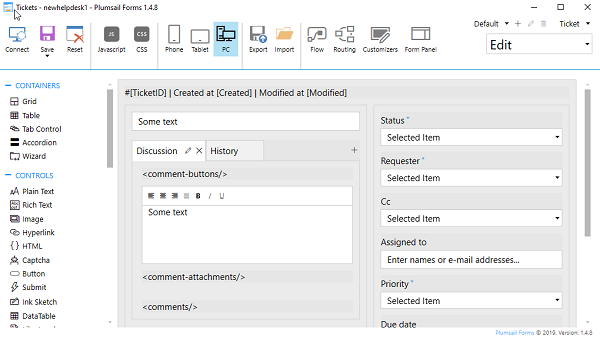
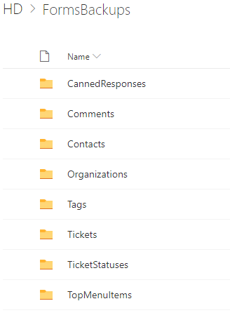
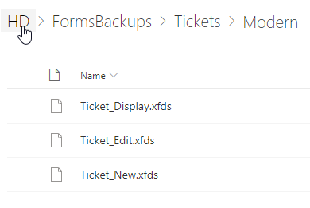

Customize ticket and contact forms
##################################

.. contents:: Table of contents
    :local:
    :depth: 1

.. note:: If you are using Plumsail HelpDesk with version older than 2.1.1, please follow  `this link <deprecated/Ticket%20and%20contact%20forms%20customization%20(before%202.1.1).html>`_ to learn about forms customization for your version of HelpDesk.

In order to customize ticket and contact forms you need to install `Plumsail Forms for SharePoint online <https://plumsail.com/forms/>`_.
It is available for free for HelpDesk customizations.
Pluimsail Forms allows you to design SharePoint forms with tabs,
complex tables, and accordions among other UI elements.

.. important:: `Plumsail Forms <https://plumsail.com/forms/>`_ is included into the "Yacht" and "Ocean liner" plans. You have to purchase it separately for the "Jet boat" plan.

Using Plumsail Forms
-------------------

To start using Plumsail Form, please `download <https://plumsail.com/forms/start-trial/>`_ a desktop app and run the installation file on your computer. To connect to HelpDesk, run the app, choose **SharePoint** and specify your HelpDesk site URL. You'll be prompted for your login details. Once it connects to HelpDesk, please choose a list you want to work with:

|PlumsailForms Sign in|

You can find more information on how to use Plumsail Forms in `the
documentation`_.

Create custom forms
-------------------

In order to customize a form with Plumsail Forms connect to the list
the form is based on. This will open  the form editor where you can customize your
form in a simple drag-and-drop fashion:

|Plumsail Forms Interface|

Restore default forms
---------------------

You can easily rollback any changes applied to the form and return to the default form. 
Default form layouts you can find in ``<your HelpDesk site>/HD/FormsBackups/`` folder.

|FormsBackupsFolder|

All layouts are splitted by three folders:

Tickets
	Contains backups of the tickets forms.

Contacts
	Contains backups of the contacts forms.

TicketStatuses
	Contains backups of the ticket statuses forms.

|TicketFormsBackups|

For example, to restore ticket edit form you need to do following steps:

1. Download file from ``<your HelpDesk site>/HD/FormsBackups/Tickets/Modern/Ticket_Edit.xfds``.
2. Connect to the Tickets list with Plumsail Forms.
3. Click on the **Import** button.
4. Select the downloaded file ``Ticket_Edit.xfds``.
5. Select **Edit** in the upper right corner of the Plumsail Forms window.
6. Save the form.
 
.. _Plumsail Forms: https://plumsail.com/forms/
.. _the documentation: https://plumsail.com/docs/forms-sp/index.html

.. |HelpDeskFDRibbon| image:: ../_static/img/helpdeskfdribbon.png
   :alt: Forms Designer Ribbon

