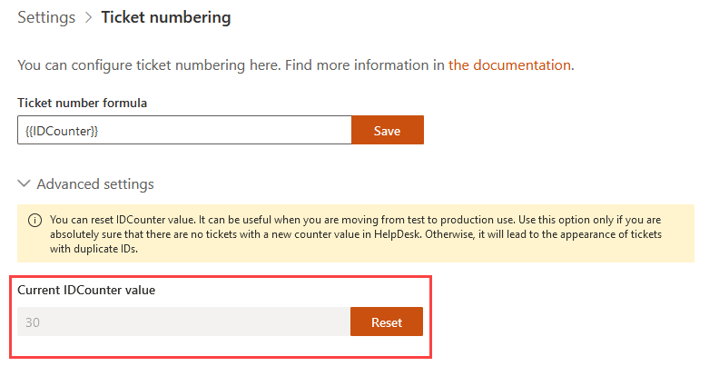

Ticket numbering customization
#######################

.. note:: This feature is available in version 1.5.5 and above.

TicketID is used to identify a ticket:

* in e-mail notifications
* on the edit and view forms
* in ticket list views.

Sometimes it can be useful to make custom numbering. 
For example, to distinguish tickets from different HelpDesk, 
or to include additional information to the ticket number (date, time, department name).

You can configure tickets numbering. 

Navigate to settings using the icon in the navbar:

|SettingsIcon|

Then click on the "Ticket numbering" tab. Now you can see ticket numbering settigs.

|PageExample|

.. contents:: Table of contents
   :local:
   :depth: 1

Formula customization
~~~~~~~~~~~~~~~~~~~~~

By default, the formula is ``{{IDCounter}}``, so tickets are numbered as "1", "2" etc. 

Formula must contain ``{{IDCounter}}`` token and may contain optional ``{{CurrentDate}}`` token.

``{{IDCounter}}`` is an instance-wide ticket counter. 

``{{CurrentDate}}`` is current date/time.

You can use ``{{CurrentDate:format}}`` syntax to show only part of current date/time. 

+--------+---------------------------------------------+------------------------+
| Format | Example formula                             | Example TicketID       |
+========+=============================================+========================+
| t      | ``IT {{IDCounter}} {{CurrentDate:t}}``      | IT 123 9:34 PM         |
+--------+---------------------------------------------+------------------------+
| d      | ``IT {{IDCounter}} {{CurrentDate:d}}``      | IT 123 2/15/2019       |
+--------+---------------------------------------------+------------------------+
| HH-mm  | ``IT {{IDCounter}} {{CurrentDate:HH-mm}}``  | IT 123 21-34           |
+--------+---------------------------------------------+------------------------+

Learn more about
`standard <https://docs.microsoft.com/en-us/dotnet/standard/base-types/standard-date-and-time-format-strings?view=netframework-4.7.2>`_
or `custom <https://docs.microsoft.com/en-us/dotnet/standard/base-types/custom-date-and-time-format-strings?view=netframework-4.7.2>`_
format strings.

As you can see, ``{{CurrentDate:HH-mm}}`` will show only hours and minutes in 24h format. 
So, you can change formula to ``IT {{IDCounter}} {{CurrentDate:HH-mm}}``.

|CustomFormula|

In this case new tickets will be numbered as "IT 3 12-35", "IT 4 14-54", "IT 5 02-55" etc

|CustomNumbering|

Reset IDCounter
~~~~~~~~~~~~~~~~

You can reset IDCounter value using "Reset IDCounter" button. 
For example, It may be useful if you are moving from test to production use.

Click "Advanced settings" to see current IDCounter value.

|Advanced|

Click "Reset IDCounter" to reset IDCounter to zero.

.. warning::
    Use this option only if you are absolutely sure that there are no tickets with a new counter value in HelpDesk. 
    Otherwise it will lead to the appearance of tickets with duplicate IDs.

.. |SettingsIcon| image:: ../_static/img/settingsicon.png
   :alt: Settings Navigation Icon

.. |CustomFormula| image:: ../_static/img/custom-formula.png
   :alt: Custom formula
.. |CustomNumbering| image:: ../_static/img/custom-ticket-numbering.png
   :alt: Custom ticket numbering demo
