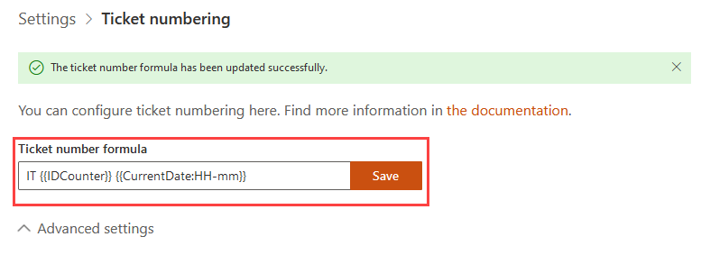
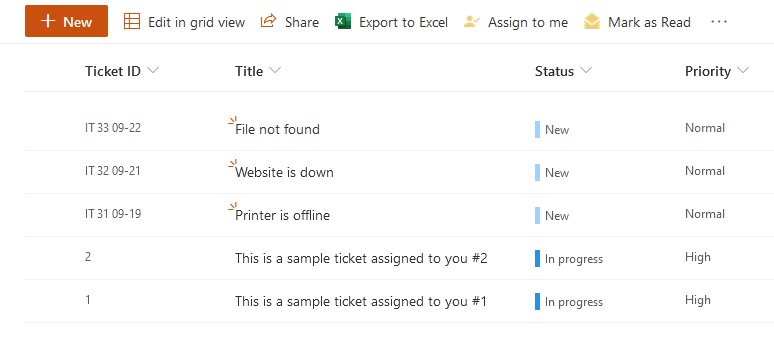

Ticket numbering customization
#######################

.. note:: This feature is available in version 1.5.5 and above.

You can configure tickets numbering. 

Navigate to settings using the icon in the navbar:

|SettingsIcon|

Then click on the "Ticket numbering" tab. Now you can see ticket numbering settigs.

|PageExampleExpanded|

.. contents:: Table of contents
   :local:
   :depth: 1

Formula customization
~~~~~~~~~~~~~~~~~~~~~

By default, the formula is **{{IDCounter}}**, so tickets are numbered as "1", "2" etc. 

Formula must contain **{{IDCounter}}** token and may contain optional **{{CurrentDate}}** token.

**IDCounter** is an instance-wide ticket counter. 

**CurrentDate** is current date/time.

You can use different formats to show only part of current date/time. 
For example, **{{CurrentDate:HH-mm}}** will show only hours and minutes in 24h format. 

So, you can change it to **IT {{IDCounter}} {{CurrentDate:HH-mm}}**.

|CustomFormula|

In this case new tickets will be numbered as "IT 3 12-35", "IT 4 14-54", "IT 5 02-55" etc

|CustomNumbering|

Reset IDCounter
~~~~~~~~~~~~~~~~

Click "Advanced settings" to see current IDCounter value.

You can reset IDCounter value using "Reset IDCounter" button. 

.. warning::
    Use this option only if you are absolutely sure that there are no tickets with a new counter value in HelpDesk. 
    Otherwise it will lead to the appearance of tickets with duplicate IDs.

.. |SettingsIcon| image:: ../_static/img/settingsicon.png
   :alt: Settings Navigation Icon
.. |PageExampleExpanded| image:: ../_static/img/ticket-numbering-page-expanded.png
   :alt: Ticket numbering settings page

