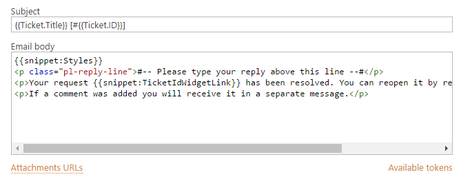

Tokens and Snippets for Actions in HelpDesk for SharePoint
##########################################################

.. contents:: Contents
	:local:
	:depth: 2

Take a look at the sample template below.
The elements enclosed between double braces are called `snippets`_ and `tokens`_.
You can use them to insert predefined or dynamic content in the context of current ticket.

|HDMessageTemplateForm|

.. _snippet:

Snippets
~~~~~~~~

Snippet is a small predefined part of a template that allows to insert blocks of information in the resulting message in context of current ticket.
It could be used only with a `Send email`_ action.
The current version doesn't support snippet customization, but there is a list of built-in snippets.
The snippet contains a keyword "snippet" and its name after a colon.

.. glossary::

	``{{snippet:AllComments}}``
		Renders a list of all comments for a current ticket.

	``{{snippet:PublicComments}}``
		Renders a list of public comments for a current ticket.

	``{{snippet:Styles}}``
		Sets the style of an email message to the default HelpDesk style via CSS.

	``{{snippet:TicketInfo}}``
		Renders a summary for current ticket as a table. 
	
	``{{snippet:TicketIdLink}}``
		Renders a link to a ticket in HelpDesk.
		
	``{{snippet:TicketIdWidgetLink}}``
		Renders a link to a ticket in Widget.
	
	``{{snippet:FeedbackLink}}``
		Renders a link to rate the service on the current ticket.

Tokens
~~~~~~

In action fields, tokens are replaced by values to which they refer.
The reference can be to properties of HelpDesk entites (tickets and comments), to context data or to collection of ticket changed fields. 
The tokens allow to use the data dynamically in trigger actions depending on current context.
All tokens begin with a keyword followed by extension(s).
The keyword determines the object of which properties are specified in extension and retrieved::

	{{Keyword.Extension}}

HelpDesk Entities
+++++++++++++++++

You can use tokens to retrieve properties of HelpDesk entities: tickets and comments in them.
In the case of tickets, it is possible to get properties of current or last ticket version.
To get a required property, one of the following keywords should be used:

#. ``{{Ticket}}`` (can be used on any event)
#. ``{{LastTicketVersion}}`` (can be used on a "Ticket has been changed" event)
#. ``{{Comment}}`` (can be used on a "Comment has been added" event)

Properties of tickets and comments are values in columns of "Tickets" and "Contacts" lists respectively.
So to get a property of a HelpDesk entity, it is necessary to use a column `internal name`_ from the accordant list::

	{{Keyword.FieldName}}

Here is a simple example of tokens that return ticket ID and title::

	{{Ticket.ID}}
	{{Ticket.Title}}

You also can retrieve values from related lists via a lookup column::

	{{Keyword.LookupFieldName.FieldName}}

In this example, tokens return a full name of requester and a name of requester's organization via lookup columns ("Requester" and "Organization")::

	{{Ticket.Requester.Title}}
	{{Ticket.Requester.Organization.Title}}

There are additional extensions for the tokens which don't refer to any columns of the "Tickets" or "Comments" lists:

.. glossary::

	``{{Ticket.AllComments}}``
		Returns a collection of list items for comments.
		You can use ``#each`` (see `advanced syntax`_)  to iterate over them.

	``{{Ticket.PublicComments}}``
		Returns a collection of list items for public comments only.

	``{{Comment.AttachmentUrls}}``
		Returns an array of attachment URLs.
		You can use ``#each`` (see `advanced syntax`_)  to iterate over them, but usually it is used in a special field of the `Send email`_ action:

	

Context Data
++++++++++++

You can use the ``{{Context}}`` keyword on any event to get site related information. There are three possible tokens:

.. glossary::

	``{{Context.SiteUrl}}``
		URL to site collection, where HelpDesk is installed.

	``{{Context.ServerUrl}}``
		URL to server, where SharePoint is hosted.

	``{{Context.WidgetUrl}}``
		default widget URL, specified in HelpDesk settings.

Changed Fields
++++++++++++++

A ``{{Data}}`` keyword has only one accessible extentsion that allows to get a collection of changed fields (columns)::

	{{Data.FieldChanges}}

It cand be used only on the "Ticket has been changed" event in the `Send email`_ action.
It is necessary to apply an ``{{each}}`` token (see `advanced syntax`_) to iterate through each column that was changed.
There are internal tokens that return values for each iteration (the name of the changed field and its values before and after changing).
Here is an example of rendering of a table in the body of message that contains all changed fields:

.. code-block:: latex

	<table class="pl-ticket-changes">
	    <tbody>
	        <tr>
	            <th>Field Name</th>
	            <th>Before</th>
	            <th>After</th>
	        </tr>
	        {{#each Data.FieldChanges}}
	        <tr>
	            <td>
	                {{FieldName}}
	            </td>
	            <td>
	                {{BeforeValue}}
	            </td>
	            <td>
	                {{AfterValue}}
	            </td>
	        </tr>
	        {{/each}}
	    </tbody>

Advanced Syntax
~~~~~~~~~~~~~~~

There are some additional helper tokens.

Iteration over Collection of Values
+++++++++++++++++++++++++++++++++++

If you need to display a block of text for each item in a collection, use an ``{{each}}`` token.
Before iterating over each element of the collection, it's necessary to define the collection of what property will be retrieved.
For this purpose use a token that refers to the property with ``#!`` in the beginning.
After, a loop should be placed with opening and closing ``{{each}}`` tokens.
The first one is marked by ``#`` and the second one - by ``/``.
The opening token should contain also a reference that contains the property defined above and separated by a space.
Inside, there is placed the content that should be iterated.
Since within the context of the each block, the scope changes to the current item, it enough to use a token with only the field name of the property.
Additionally, you can access the index of current item using an ``{{#index}}`` token.

Let's take a look at the example bellow:

.. code-block:: latex

	{{#!Ticket.AllComments.Body}}
	{{#each Ticket.AllComments}}
	    
{{#index}}

	    
{{Body}}

	{{/each}}

``{{#!Ticket.AllComments.Body}}`` defines that there will be a loop to iterate the body of all comments of current ticket.
Then ``{{#each Ticket.AllComments}}`` opens the loop specifying where the defined property is and ``{{/each}}`` closes the one.
``{{#index}}`` returns the index of current comment in the collection and ``{{Body}}`` will be replaced by the body of each retrieved comment.
The opening token has ``#`` in the beginning and is combined with reference and the closing one has ``/`` there. 
that contains the property defined above in combination with ``#each`` and closed by ``{{/each}}`` token.

Conditional Including of Values
+++++++++++++++++++++++++++++++

The ``{{if}}`` token allows you to include a block of text conditionally.
As the previous one, it also has opening and closing tokens, and the first one should contain a reference to an available property.
The block placed between the opening and closing tokens will be printed if:

-  The value is a non-empty string.
-  The value is a non-empty collection.
-  The value isn't the ``null`` value.
-  The value is a non-zero number.
-  The value evaluates to ``true``.

The ``{{if}}`` token has complimentary ``{{elif}}`` and ``{{else}}`` tokens.
There can be as many ``{{elif}}`` tokens as desired but the ``{{else}}`` token must appear only once and after all other tokens (but before the closing one).
The ``{{elif}}`` token checks other conditions and the ``{{else}}`` one prints its block in any other case.

Here is an example of condition:

.. code-block:: latex

	{{#if Ticket.Requester}}
	    {{Ticket.Requester.Title}}
	{{#elif Ticket.AssignedTo}}
	    {{Ticket.AssignedTo.Title}}
	{{#else}}
	    
There is no whether a requester nor an agent assigned to the ticket.

	{{/if}}

The ``{{#if Ticket.Requester}}`` token opens a condition.
It checks whether the "Requester" field is not empty.
If it is not, the ``{{Ticket.Requester.Title}}`` token renders the name of requester, otherwise, the ``{{#elif Ticket.AssignedTo}}`` one checks if the "AssignedTo" field is not empty.
If it is not, the ``{{Ticket.AssignedTo.Title}}`` token renders the name of agent, otherwise, the predefined block of text is rendered (``
``).
The ``{{/if}}`` token closes the condition.
 
.. _workflows customization documentation: Workflow%20customization.html
.. _snippets: #snippet
.. _tokens: #tokens
.. _advanced syntax: #advanced-syntax
.. _Send email: General%20information.html#send-email
.. _internal name: ../How%20To/Find%20the%20internal%20name%20of%20SharePoint%20column.html

