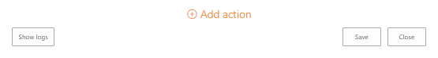
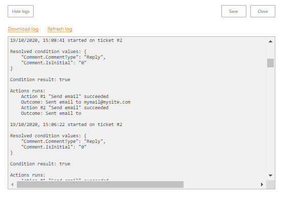
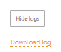
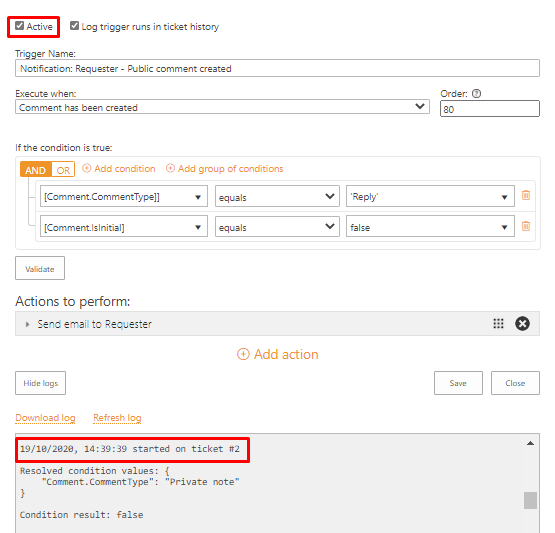
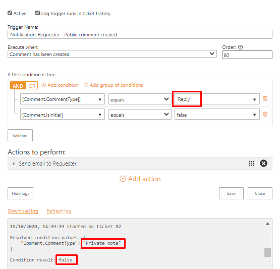
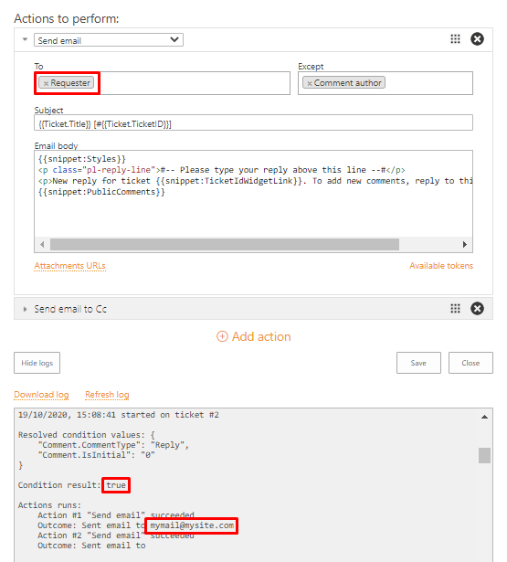

Troubleshooting triggers
========================

.. contents::
    :local:
    :depth: 2

General information on logs
---------------------------

Trigger logs can help to clarify the source of possible issues.
Open the configuration of a problem trigger and click a button **Show logs** at the bottom.

|logs-1|

Each record contains four parts:

* **timestamp** and **ticket ID** when and on which the trigger fired
* resolved **condition values**, i.e. values for the references to the current ticket or comment fields
* **condition result** which indicates whether the trigger tried to perform further actions or not
* report about **action result** if the condition resolved to ``true``

|logs-2|
 
If logs did not help and you are going to turn for support, it is a good idea to download and share a log file in your request.
The text-file will contain not only logs about the execution of a trigger but also an object with its **configuration**.

|logs-3|
 
Troubleshooting of requester notifications
------------------------------------------

The troubleshooting process is considered in the example when a requester does not receive notifications about new replies from an agent.

Check trigger fires
~~~~~~~~~~~~~~~~~~~

Examine **timestamps** and **ticket IDs** of recent fires.
If just one specific occurrence is absent, ensure that you added the reply: perhaps, there was an error that prevented it.
If the trigger did not work for multiple new comments added and it is active (the checkbox at the top), then most likely, there is a problem on a server-side.
**Download logs** and turn for support, specify sample ticket IDs and time of adding new replies on which the trigger hadn’t worked.

|logs-4|
 
Check the meeting the condition
~~~~~~~~~~~~~~~~~~~~~~~~~~~~~~~

If the trigger fired, but the **condition result** was ``false``, it means that the case does not meet the condition expression—check the **resolved values**.
You need either ensure that the ticket/comment has required properties or edit trigger’s condition.
In this case, the agent accidentally added a private note instead of a public reply, so he needs to re-add the comment to the ticket and ensure that it is of a proper type.

|logs-5|
 
Check the sending off the message
~~~~~~~~~~~~~~~~~~~~~~~~~~~~~~~~~

If the condition resolved to ``true``, then the trigger tried to send the notification.
In this case, it is necessary to check **action results**: whether it was successful or not and whether it sent the message to the proper e-mail address.
If necessary, edit trigger’s action.

|logs-6|

