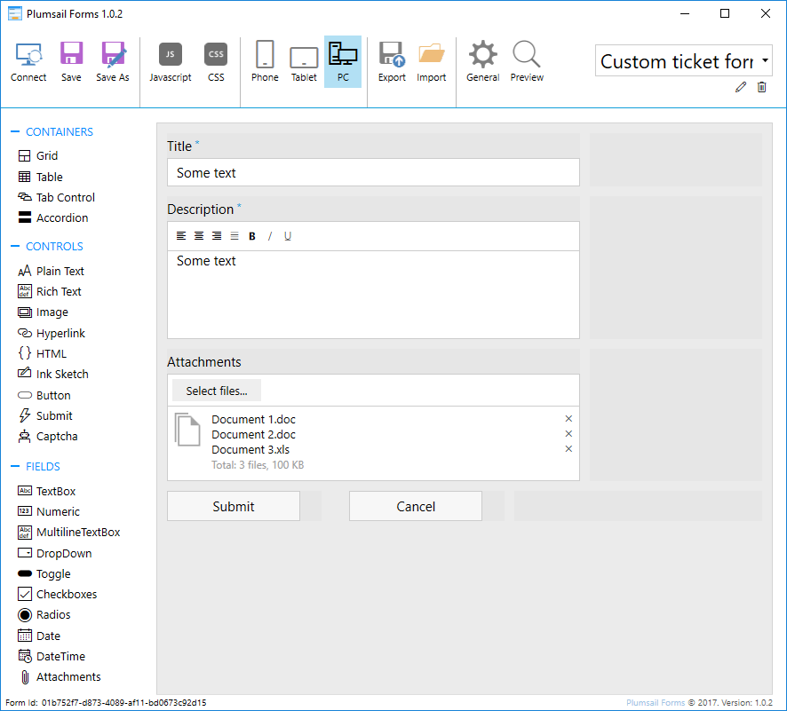
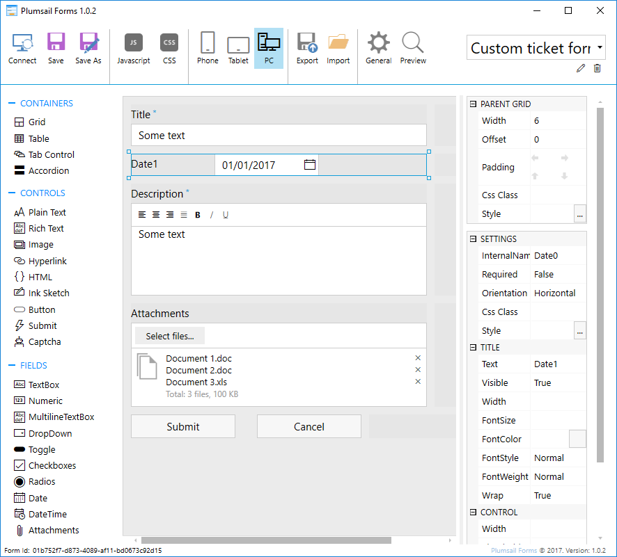
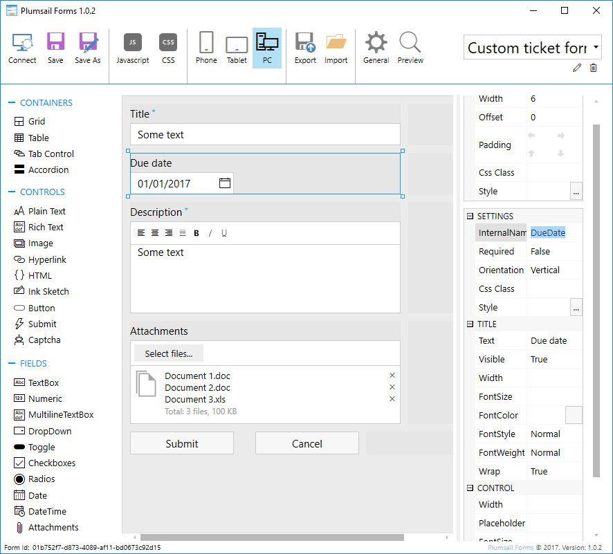
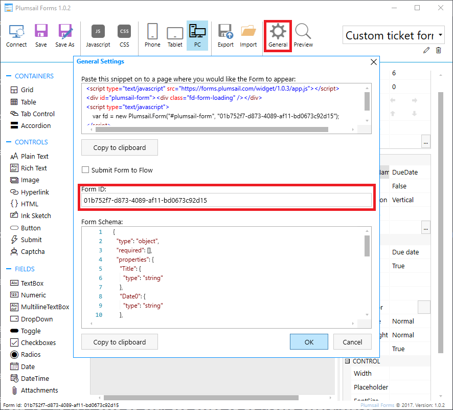
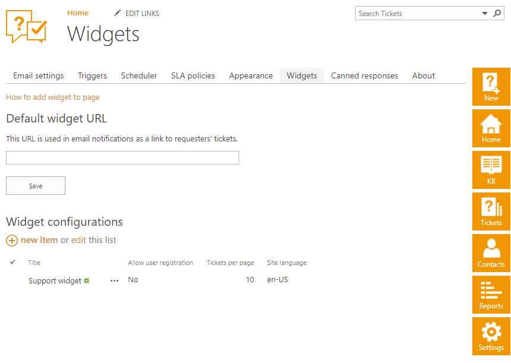
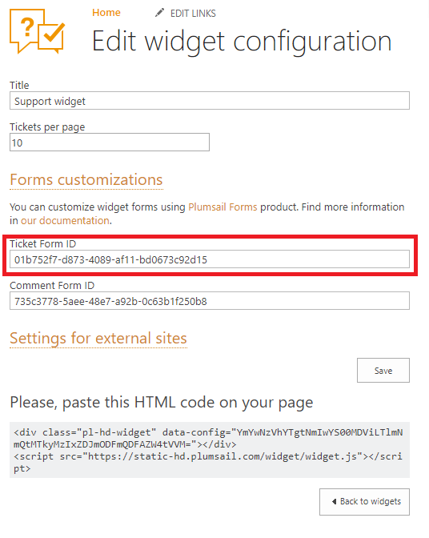
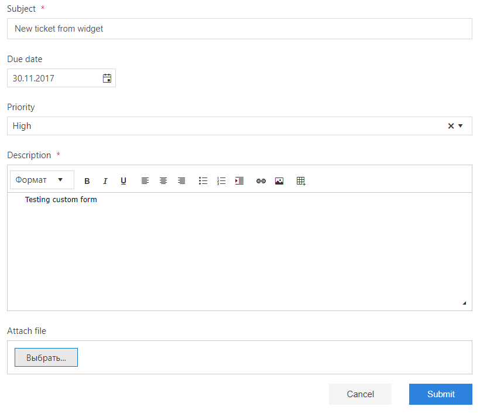

Customize widget forms
######################

In order to customize new ticket and new comment forms in widget you will need to install `Plumsail Forms`_.
This is another Plumsail product with a separate pricing.
With `Plumsail Forms` you can modify form markup and add custom fields to a form, so requester will be able to fill those fields on ticket creation.

.. note::
   Only text, datetime and choice fields are supported in current version. If you need to add more complex field types please drop a line on support@plumsail.com.

You can find detailed information on how to use Plumsail Forms in `the
documentation`_.

.. contents:: Table of contents
   :local:
   :depth: 1

Creating custom widget form
~~~~~~~~~~~~~~~~~~~~~~~~~~~

Let's look on a step by step example how to add a custom field to the ticket creation form.

Install `Plumsail Forms`_.

Download default widget forms here: `ticket form`_\, `comment form`_\.

Import default ticket form from downloaded file and save the form. You cand find detailed in formation about import and export `here`_\. 

|Default widget form|

As an example, you can add Due Date filed to the new ticket form. Drag Date control from the Fields section and drop it to the form

|Custom widget form with date field|

When adding custom field, make sure that control internal name matches internal name of corresponding field in SharePoint list.
You can learn how to find internal name of the field in `this article`_\.
In our case, we need to set internal name of our Date1 control to DueDate.
You can change control Orientation property to Vertical to display the field title above the field.

|Custom widget form with DueDate field|

Save your changes. You prepared your custom form, the next step is to cofigure your widget to use it.
Each Plumsail Form has unique Form Id. We will need to copy and paste it to widget configuration.

Press General button on Plumsail Forms ribbon and copy Form Id from General settings window.

|Copy widget form Id|

Navigate to your HelpDesk Widgets settings page.

|Widget settings page|

Open existing widget configuration or create a new one and expand Forms customizations section.
It contains two fields: Ticket Form ID and Comment Form ID. By default they are filled with default forms IDs.
You need to replace this values with your custom form IDs to make widget use your own forms.
In our case we will replace Ticket Form ID with the value copied from Plumsail Forms settings.

.. note::
   Widget form IDs are cached for 30 minutes for optimisation purposes. You will need to clear browser cache to apply your changes immediatly.

|Set widget config form id|

Save your widget config and test your widget.

|Custom widget form applied|

Restore default forms
~~~~~~~~~~~~~~~~~~~~~

You can easily return to using default widget forms.

To do this you will need to navigate to your HelpDesk Widgets settings page, open widget configuration, expand Forms customizations section and replace custom form IDs with default values:

- 633ea9ae-1f2a-47ed-a56c-7d4f2a363a02 for ticket form
- 735c3778-5aee-48e7-a92b-0c63b1f250b8 for comment form

.. |Custom widget form| image:: ../_static/img/custom-widget-form.png
   :alt: Custom widget form

   

.. _Plumsail Forms: https://plumsail.com/forms
.. _here: https://plumsail.com/docs/forms/designer/ribbon-actions.html#export-and-import
.. _the documentation: https://plumsail.com/docs/forms
.. _ticket form: ../_static/download/Ticket.xfds
.. _comment form: ../_static/download/Comment.xfds
.. _this article: ../How%20To/Find%20the%20internal%20name%20of%20SharePoint%20column.html
