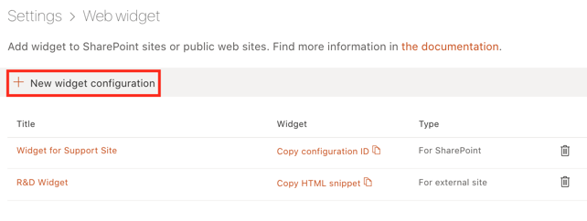
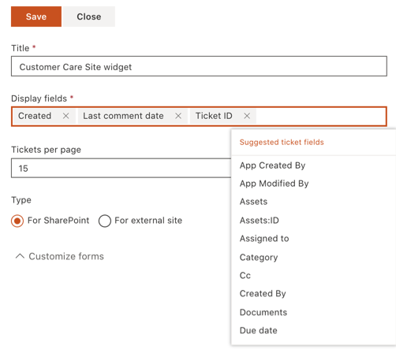
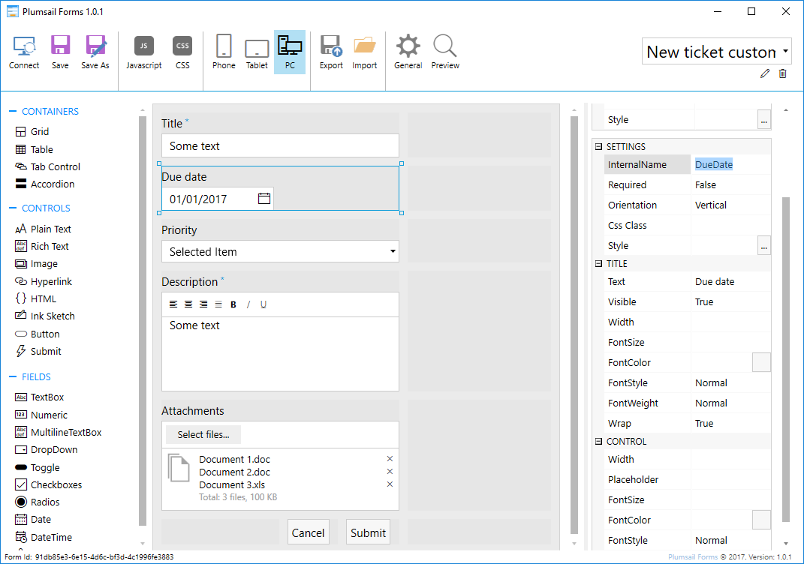
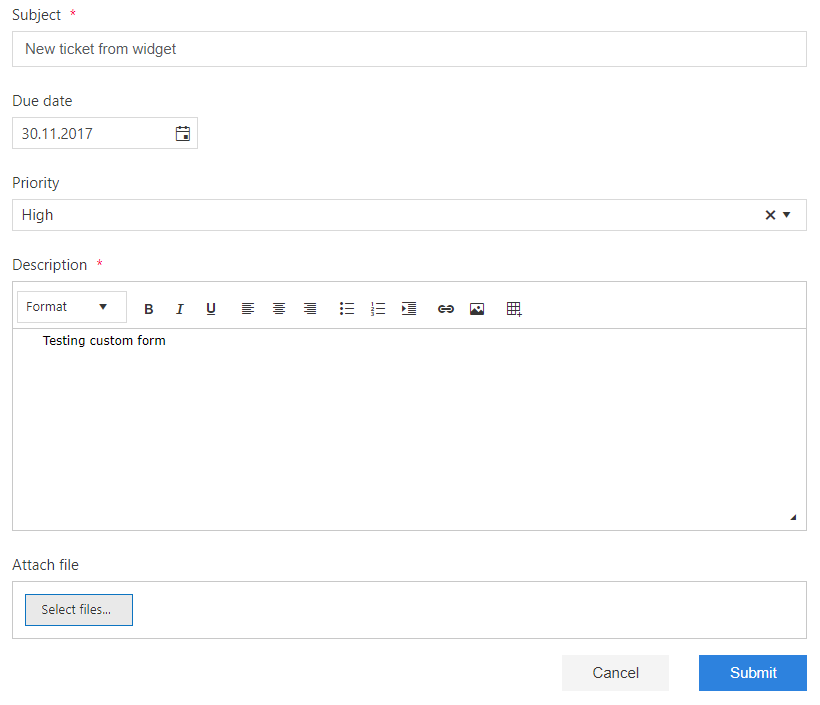

Widget
######

.. admonition:: Known issues
	:class: warning

	The latest version of Google Chrome browser doesn't support embedding scripts with Script Editor Web Part.
	Please use different browsers like Microsoft Edge or Mozilla Firefox.

HelpDesk Widet is a tool for requesters allowing them to review their tickets, add comments and attachments. It can be embedded in a public website or a SharePoint site other than a site where the HelpDesk is installed, so requesters will not have access to all tickets in your help desk.

Here is 'My tickets' view looks like for end-users:

|WidgetView|

Adding widget to SharePoint site
~~~~~~~~~~~~~~~~~~~~~~~~~~~~~~~~

Open SharePoint site where you want to place the widget.

Install Plumsail HelpDesk Widget add-in from `SharePoint App store <https://store.office.com/en-us/app.aspx?assetid=WA104380769&sourcecorrid=764978a8-0233-4b42-b2e4-7724d130dcf5&searchapppos=0&ui=en-US&rs=en-US&ad=US&appredirect=false&canaryguid=c737b959d79b439bb20bebb5befabc00&reviewedAssetRating=5&AuthType=1&fromAR=1>`_. Installing of the add-in is required to enable automitic sign-in under current SharePoint user in widget.

Then you need to place widget to specific SharePoint page. Steps to do that are described below.

Navigate to e-mail settings using navbar.

|EmailSettings|

Then click “Widgets” tab.

|WidgetTab|

Here you can create a new widget configuration for your page by choosing 'New item' and edit any existing configurations by clicking 'Edit'. Note that editing of widget configuration is employing to every existing widget with this configuration.

|NewWidget|

Provide a title for a widget configuration and choose how many tickets will be displayed on the page.
If you are creating a widget for external site, you can choose widget language and whether to allow user registration. Registered users have ability to review their tickets.

|WidgetMenu|

After saving this configuration, HTML code will be generated and you need to copy it.

|GenHTML|

Navigate to a page where you'd like to place a widget and click ‘Edit’ on the site ribbon menu.

|EditPage|

Choose the place where the app will be shown and click ‘Insert’ tab. Here you need to choose ‘Embed code’ option and just paste HTML code which you copied before in the pop-up window.
Finish with clicking ‘Save’ on the ribbon.

|Finish|

Adding widget to external site
~~~~~~~~~~~~~~~~~~~~~~~~~~~~~~

Adding a widget to an external site is quite similar to adding it to SharePoint site. Just copy an auto-generated HTML code, open editing form of HTML page and add copied code where you'd like to place a widget.

Customizing widget forms
~~~~~~~~~~~~~~~~~~~~~~~~
You can customize widget forms using `Plumsail Forms`_\. It is another Plumsail product with a separate pricing.
Only new ticket form and new comment form are available for modifications.

With `Plumsail Forms` you can modify form markup and add custom fields to a form, so requester will be able to fill those fields on ticket creation.

.. note::
   Only text, datetime and choice fields are supported in current version, please drop a line on support@plumsail.com if you need to add more complex field types.

To edit widget form you will need to:

- Download default form: `ticket form`_\, `comment form`_\
- Install `Plumsail Forms`_\  and import default form from downloaded file
- Modify custom form and save it. If you want to add custom field, make sure that control internal name matches internal name of corresponding field in SharePoint list.

|Custom widget form|

- Copy your form id from General Settings window and paste it co corresponding field on widget cofiguration form

|Custom widget form settings| |Set widget form id|

- Save widget configuration and test your form

|Custom widget form applied|

.. note::
   Widget form ids are cached for 30 minutes for optimisation purposes. You will need to clear browser cache to apply your changes immediatly.

.. |WidgetView| image:: ../_static/img/widgetview.png
   :alt: HelpDesk Widget
.. |EmailSettings| image:: ../_static/img/settingsicon.png
   :alt: E-mail settings
.. |WidgetTab| image:: ../_static/img/tab.png
   :alt: Widget Tab

.. |EditPage| image:: ../_static/img/editpage.png
   :alt: Adding a widget to your site
.. |Finish| image:: ../_static/img/finish.png
   :alt: Inserting a widget

.. _Plumsail Forms: https://plumsail.com/forms
.. _ticket form: ../_static/download/Ticket.xfds
.. _comment form: ../_static/download/Comment.xfds

.. _Install:
