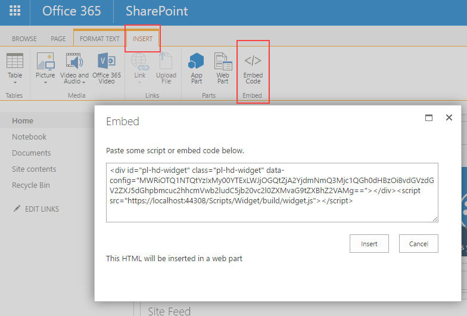
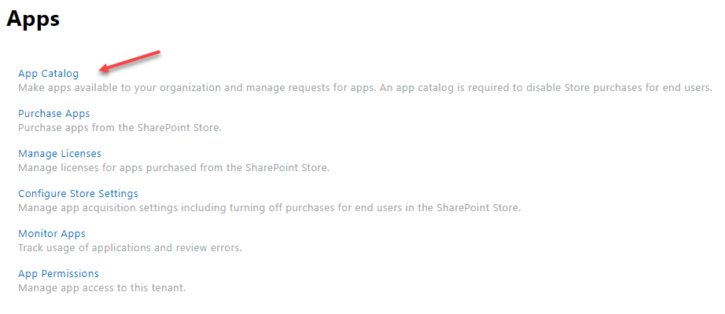
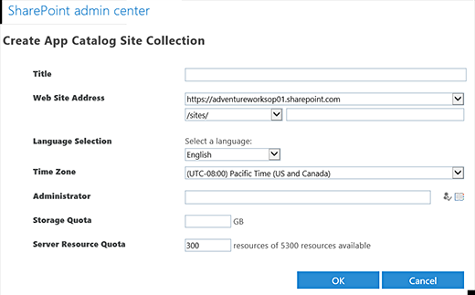
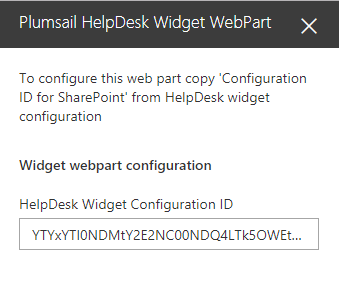
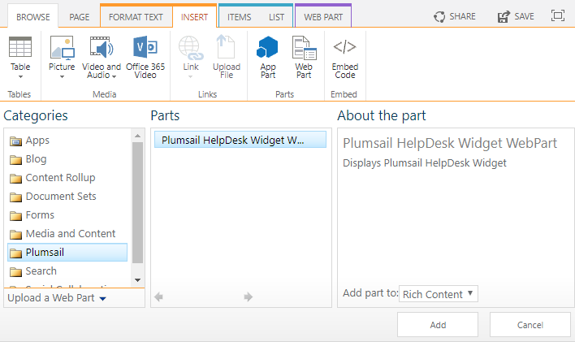

Widget
######

 .. note::
    | If you are using Plumsail HelpDesk with version older than 1.4.4, please follow  `this link <deprecated/Widget.html>`_ to learn about HelpDesk Widget.

HelpDesk Widet is a tool for requesters allowing them to review their tickets, add comments and attachments. It can be embedded in a public website or a SharePoint site other than a site where the HelpDesk is installed, so requesters will not have access to all tickets in your help desk.

Here is 'My tickets' view looks like for end-users:

|WidgetView|

Adding widget to SharePoint site
~~~~~~~~~~~~~~~~~~~~~~~~~~~~~~~~

Installing Widget WebPart
-------------------------

HelpDesk Widet for SharePoint sites is a a `SharePoint Framework <https://docs.microsoft.com/en-us/sharepoint/dev/spfx/sharepoint-framework-overview>`_ add-in that can be added both on classic and modern SharePoint pages. Unfortunately, SharePoint Store doesn’t support the installation of SharePoint Framework add-ins. That is why you need to install add-in manually.

You have to be a SharePoint administrator to complete the installation. If you don’t see some menus from the instruction below, most likely you are not a SharePoint administrator. Please contact your administrator to assist with the installation.

Open Office 365 admin center:

|Office365AdminCenter|

Navigate to SharePoint Admin Center:

|SharePointAdminCenter|

Open ‘App catalog’:

|OpenAppCatalog|

If you don’t have ‘App Catalog’ yet, you will be able to create a new one:

|CreateAppCatalog|

Just fill in ‘Title’, ‘Web Site Address’, ‘Administrator’ and ‘Storage Quota’ and click ‘OK’. For example:

 - Title – App Catalog Site
 - Web Site address – AppCatalog
 - Administrator – Fill in your account name
 - Storage Quota – 10 GB

|NewAppCatalog|

`Download the add-in <https://static.plumsail.com/wp-content/uploads/Files/HelpDesk365Widget/plumsail-help-desk-widget-web-part.sppkg>`_ from our website. Navigate to ‘Apps for SharePoint’ and upload Add-in package that you downloaded (you need to upload to the App Catalog the whole .sppkg file without unpacking it):

|UploadSPPKG|

You need to select “Make this solution available to all sites in the organization” in the dialog. Once you did this you can add a web part to a page.

|TenantScopedWP|

If you don’t want to make this app availalbe on all sites, you will need to `add app to each site manually <InstallWidgetAddInOnSite.html>`_.

Creating widget configuration
-----------------------------

The next step is to configure your future widget. 

Open HelpDesk site and navigate to e-mail settings using navbar.

|EmailSettings|

Then click “Widgets” tab.

|WidgetTab|

Here you can create a new widget configuration for your page by choosing 'New item' and edit any existing configurations by clicking 'Edit'. Note that editing of widget configuration is employing to every existing widget with this configuration.

|NewWidget|

Provide a title for a widget configuration and choose how many tickets will be displayed on the page.
If you are creating a widget for external site, you can choose widget language and whether to allow user registration. Registered users have ability to review their tickets.

|WidgetMenu|

After saving, HTML code for external sites and configuration ID for SharePoint will be generated and you need to copy SharePoint Configuration ID.

|GenSPConfigID|

Open SharePoint site where you want to place the widget.

Install Plumsail HelpDesk Widget add-in from `SharePoint App store <https://store.office.com/en-us/app.aspx?assetid=WA104380769&sourcecorrid=764978a8-0233-4b42-b2e4-7724d130dcf5&searchapppos=0&ui=en-US&rs=en-US&ad=US&appredirect=false&canaryguid=c737b959d79b439bb20bebb5befabc00&reviewedAssetRating=5&AuthType=1&fromAR=1>`_. Installing of the add-in is required to enable automatic sign-in under current SharePoint user in widget.

Then you need to place widget to specific SharePoint page. Steps to do that are described below.

Adding widget to modern SharePoint page
--------------------------------------

Navigate to a page where you'd like to place a widget.

Pick ‘Plumsail HelpDesk Widget WebPart’ web part from the menu to add it to your page:

|PickWPOnModernPage|

Once you added the web part you need to configure it. Just copy 'Configuration ID for SharePoint' from widget configuration form and paste it to corresponding web part property.

|ConfigureModernWP|

Publish the page. Your HelpDesk widget is ready to use.

|WidgetOnModernPage|

Adding widget to classic SharePoint page
--------------------------------------

Navigate to a page where you'd like to place a widget and open the page in the edit mode.

Click ‘Insert → Web Part’. 

Pick ‘Plumsail’ category in the list of web part categories.

Pick ‘Plumsail HelpDesk Widget WebPart’ web part and click ‘Add’:

|PickWPOnClassicPage|

Once you added the web part you need to configure it. Just copy 'Configuration ID for SharePoint' from widget configuration form and paste it to corresponding web part property.

Save the page. Your HelpDesk widget is ready to use.

|WidgetOnClassicPage|

Adding widget to external site
~~~~~~~~~~~~~~~~~~~~~~~~~~~~~~

Addind widget to an extarnal site is quite simple. Just copy an auto-generated HTML code from widget configuration form, open editing form of HTML page and add copied code where you'd like to place a widget.

|GenGeneratedHTML|

.. |WidgetView| image:: ../_static/img/widgetview.png
   :alt: HelpDesk Widget
.. |EmailSettings| image:: ../_static/img/settingsicon.png
   :alt: E-mail settings
.. |WidgetTab| image:: ../_static/img/tab.png
   :alt: Widget Tab
.. |NewWidget| image:: ../_static/img/newitem.png
   :alt: Create a new item
.. |WidgetMenu| image:: ../_static/img/newwidget.png
   :alt: Widget settings
.. |GenSPConfigID| image:: ../_static/img/widget-get-sp-config-id.png
   :alt: Generated HTML code
.. |EditPage| image:: ../_static/img/editpage.png
   :alt: Adding a widget to your site

.. |Office365AdminCenter| image:: ../_static/img/widget-open-admin-center.png
.. |SharePointAdminCenter| image:: ../_static/img/widget-navigate-to-sharepoint-admin-center.png

.. |CreateAppCatalog| image:: ../_static/img/widget-create-app-catalog.png

.. |UploadSPPKG| image:: ../_static/img/widget-upload-sppkg.png
.. |TenantScopedWP| image:: ../_static/img/widget-tenant-scoped-webpart.png
.. |PickWPOnModernPage| image:: ../_static/img/widget-pick-wp-on-modern-page.png

.. |WidgetOnModernPage| image:: ../_static/img/widget-on-modern-page.png

.. |WidgetOnClassicPage| image:: ../_static/img/widget-on-classic-page.png
.. |GenGeneratedHTML| image:: ../_static/img/widget-get-html.png

.. _this link: /Configuration%20Guide/deprecated/Widget.html
