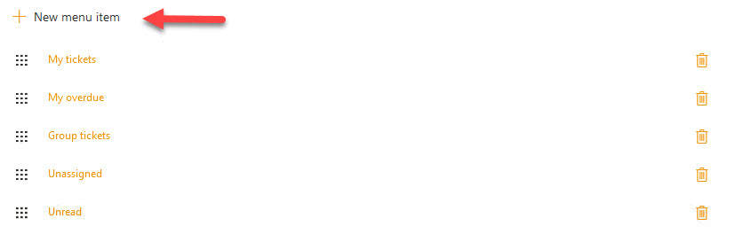

Appearance settings
###################

You can hide or display the SharePoint out of the box quick launch bar
as well as customize HelpDesk navigation.

Navigate to settings   using the icon in the navbar

|SettingsIcon|

Then click on the “Appearance” tab. Now you can see the quick launch
display setting and a list of HelpDesk navigation elements.

|navigationsets|

.. contents:: Table of contents
   :local:
   :depth: 1

Quick launch
~~~~~~~~~~~~

By default, quick launch bar is hidden, but you can unhide it with this
setting. If this setting is on then the bar is displayed on every page:

|leftsidebar|

Right navigation
~~~~~~~~~~~~~~~~

HelpDesk navigation is a set of icons on the right-hand side of
HelpDesk. You can customize them by changing the navigation list items:

-  Add new item to create a new navigation element
-  Change existing items to modify their properties

To modify an existing button click the respective navigation list entry.
If you want to create a new button, click "New link". You will see a
dialog with an ability to set link properties.

|navigationEdit|

Top menu customization 
~~~~~~~~~~~~~~~~~~~~~~

HelpDesk top menu is a set of buttons  with different ticket views. You can customize them by adding a new button with a view or URL to external site. You can change existing buttons as well.

To add a new item to top navigation, click “New top menu item”.

|NewTopMenu|

You will see a dialog window where you need provide a title for a new item and select ticket view. If you choose a link instead of view, please provide aan URL.

|NewItem|

In Order field, provide an index number which the new item will take place in the line of existing elements. 
Don’t forget to save a new item.

If you have troubles with deleting the item, open your browser's console and type localStorage.clear() there. Then renew the page.

.. |SettingsIcon| image:: ../../_static/img/settingsicon.png
   :alt: Settings Navigation Icon
.. |navigationsets| image:: ../../_static/img/navigation-0.png
   :alt: Navigation Sets
.. |leftsidebar| image:: ../../_static/img/navigation-1.png
   :alt: Left Side Bar
.. |navigationEdit| image:: ../../_static/img/navigation_edit.png
   :alt: Navigation Edit

