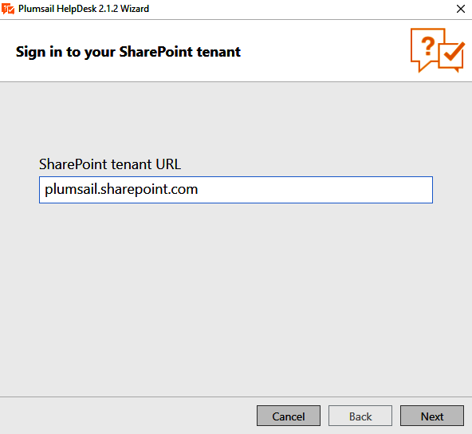
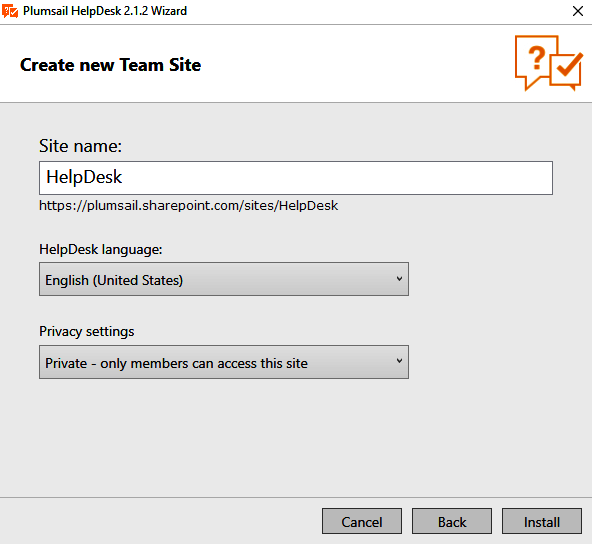

HelpDesk installation
#####################

`Download`_ and run the setup file.

Then specify your SharePoint tenant URL where a HelpDesk instance will be created:

|HelpDeskOnlineInstallAuthentication|

You will be prompted for your credentials. Please enter the **tenant admin** credentials.

Then you'll be asked to choose the HelpDesk site name, languange and privacy settings:

|HelpDeskOnlineInstallSiteName|

Your HelpDesk site will be available under: **yourdomain**.sharepoint.com/sites/**sitename**

Once HelpDesk has been installed, you can go on to `configuration`_.

Known Issues
++++++++++++

Unfortunately, sometimes SharePoint Online experiences outages.
Incidents that affect Office 365 or SharePoint Online can hinder to install HelpDesk.
In this case, you will encounter errors which will be listed in the HelpDesk wizard.
First of all, try to click "Try again" button of the wizard to repeat the failed steps.
Then, if it doesn't help, check the `health status`_ of Office 365 services ("Health" feature of Microsoft 365 admin center).
If there are problems that affect the specified services, wait until they are resolved and try to install HelpDesk again.

.. _Download: https://plumsail.com/sharepoint-helpdesk/download/
.. _this article: ../Configuration%20Guide/Enabling%20scripting.html
.. _configuration: Quick%20HelpDesk%20configuration.html
.. _health status: https://admin.microsoft.com/Adminportal/Home#/servicehealth

