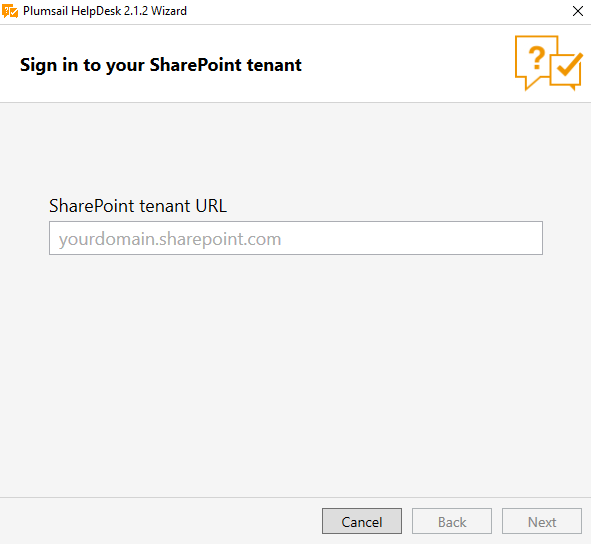

HelpDesk installation
#####################

`Download`_ and run the setup file.

.. important:: SmartScreen prompt does not show for ClickOnce app since Windows 10 Update 1803. If you experience this issue please `download`_ **HelpDesk installer archive**, unpack it and run *Plumsail.HelpDesk.Online.Wizard.exe* manually.

Then specify the URL where a
HelpDesk instance will be created and credentials for Full Control
access:

|HelpDeskOnlineInstallAuthentication|

Follow the wizard steps.

.. note::
	If you specify a nonexisting site, it will be created automatically. 
	For example, if you specify *https://yourdomain.sharepoint.com/*\ **HelpDesk**
	and **HelpDesk** doesn’t	exist, it will be created for you. 

.. admonition:: Known issues
	:class: warning

	We are not able to install HelpDesk unless scripting
	capabilities are enabled. Please make sure that you enabled scripting
	capabilities. Read `this article`_ for more information.

Once HelpDesk has been installed, you can go on to `configuration`_.

.. _Download: https://plumsail.com/sharepoint-helpdesk/download/
.. _download: https://plumsail.com/sharepoint-helpdesk/download/
.. _this article: ../Configuration%20Guide/Enabling%20scripting.html
.. _configuration: Quick%20HelpDesk%20configuration.html

