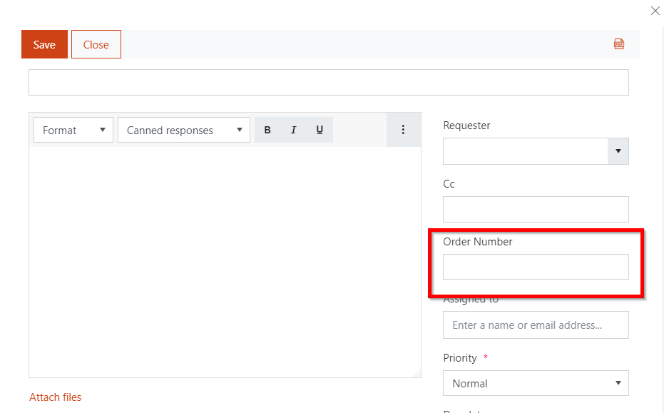

Add a new column to tickets list and form
#########################################

Here's how to customize the Ticket form in your HelpDesk by adding new columns to it.

First of all, head to ticket list settings.

|ListSettings|

Select ‘Create column’. 

|CreateColumn|

Choose column type which goes along with your task and decide if the information in this column should be optional or required. 

|ColumnSettings|

To put the column into action, place it on the ticket form with the help of `Plumsail Forms <https://plumsail.com/forms/>`_. You can find more information about forms customization in `this article <../Configuration%20Guide/Ticket%20and%20contact%20forms%20customization.html>`_.
Finally, you can place the newly created column in three types of forms — Edit, New, and Display. 
Choose one of them  and drag your column from left-side bar to template of the ticket form.

|Forms|

It’s important to save each type of form separately otherwise, a pattern of editing form will be applied to others.

|Save|

This how your ticket's editing form will look like:

|TicketEditForm|

.. |ListSettings| image:: ../_static/img/list-settings-online-1.jpg
   :alt: List settings
.. |CreateColumn| image:: ../_static/img/create-column.jpg
   :alt: Create column
.. |ColumnSettings| image:: ../_static/img/create-column-1.jpg
   :alt: Column settings
.. |Forms| image:: ../_static/img/forms-online-1.jpg
   :alt: Drag-and-drop new column
.. |Save| image:: ../_static/img/forms-online-2.jpg
   :alt:  Pay attention to Save settings
