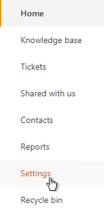

Add new email notifications
###########################

Here you can find how to customize email notifications in your service desk.

You can create a new trigger that runs when a help desk ticket is updated in some specific way. For example, you can configure a trigger which will notify a specific person when a ticket priority is changed to urgent.

This is an example of such notification:

|NotificatonLetter|

Navigate to the settings using the icon in the navbar:

|SettingsIcon|

Click the "Triggers" tab, then create a new item.

The ‘Event’ field specifies an action that trigger will perform – in this case it’s going to be ‘Send email’. If you need notifications to be sent only in case a ticket has been changed, choose the corresponding option in dropdown menu. ‘Conditions’ field defines the conditions which should be met in order for the action to be performed.

|TicketForm|

This above defines two conditions that must be met for the trigger to fire, namely that Priority should have been changed and it should be ‘Urgent’ now. More about syntax you can find out `here`_.

Note that Subject and Email body have been specified inside this action. Some `tokens`_  were used to receive information about ticket title, its ID and the person who escalate it. 

After that, add a new action and select ‘Send email’. You can choose a person from Contact list that’s going to receive notifications regarding ticket’s priority status change. Save the trigger and you will receive e-mails like on the first screenshot.

.. |NotificatonLetter| image:: ../_static/img/new-niotification.jpg
   :alt: Example of the new notification

.. |TicketForm| image:: ../_static/img/new-niotification-1.png
   :alt: New trigger's condition

.. _Forms Designer: https://plumsail.com/docs/help-desk-o365/v1.x/Configuration%20Guide/Forms%20customization.html
.. _Triggers: https://plumsail.com/docs/help-desk-o365/v1.x/Configuration%20Guide/Triggers.html
.. _here: https://plumsail.com/docs/help-desk-o365/v1.x/Configuration%20Guide/Condition%20syntax.html
.. _tokens: https://plumsail.com/docs/help-desk-o365/v1.x/Configuration%20Guide/Tokens%20and%20snippets.html
