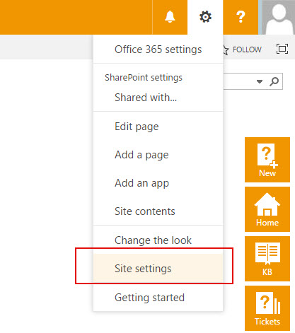

Assign ticket to multiple agents
################################

SharePoint group is a pool of SharePoint users with the same permission level. If you'd like to 
assign a ticket to Group, you need to create one. For that, click on **Site permissions** in the 
site menu.

|siteSettings|

Click on **Advanced permissions**.
Under site permissions you can find predefined groups with different permission levels, they were automatically assigned to the site when it was created. You need to create a new group, so right click on ‘Create Group’.

|createGroup|

You can organize users into any number of groups.

|GroupSettings|

You can choose any permission level depending on what level of access you need.

|groupPermission|

To add new users to your group select **Add users** in the dropdown menu.

|AddUsers|

In Share dialog enter names or e-mail addresses of users that you want to add to group. You can even add external users to SharePoint Online groups if they have Microsoft Live ID. If you’d like to add personal touch, provide some text that will accompany the invitation.

|groupDialog|

Now you can assign tickets to group.

|groupExample|

.. |createGroup| image:: ../_static/img/createGroup.jpg
   :alt: Create a group
.. |GroupSettings| image:: ../_static/img/create-group-1.jpg
   :alt:   
.. |groupPermission| image:: ../_static/img/group-permission.jpg
   :alt: Group permission level
.. |AddUsers| image:: ../_static/img/addUsers.jpg
   :alt:  Add new users
.. |groupDialog| image:: ../_static/img/group-dialog.jpg
   :alt:  Share pop up window
.. |groupExample| image:: ../_static/img/group-example.jpg
   :alt:  Example of assignment
