Assign ticket to multiple agents
################################

.. contents:: Table of contents
   :local:
   :depth: 1

Assign tickets to Microsoft 365 group
-------------------------------------

Microsoft 365 group is a tool for collaboration and sharing resources within your tenant.
You can assign tickets to existing ones what makes it possible for all group members to receive notifications about new replies in a ticket.
If you do not have the one you would like to use in HelpDesk, create it.
Open the list of **active groups** in `Microsoft 365 admin center <https://admin.microsoft.com/Adminportal/Home#/groups>`_ and **add** a new one.

|M365-add|

**Configure** the group going through the all wizard steps.
If required, you can set any group type other than Microsoft 365.
But this one provides you with all advantages of the Microsoft services.

|M365-type|

|M365-name|

|M365-owner|

|M365-settings|

|M365-finish|

After you have created the group, **open** it for further set-up.

|M365-open|

**Add new members** to the group.

|M365-viewMembers|

|M365-addMembers|

|M365-saveMembers|

It is required to allow receiving **external messages** (HelpDesk notifications).
If the members should receive their copies, check the accordant option too.

|M365-email|

Now, you can **assign a ticket** to the newly created Microsoft 365 group.

|M365-assign|

Assign tickets to SharePoint group
----------------------------------

SharePoint group is a pool of SharePoint users with the same permission level.
If you would like to assign a ticket to a group, you need to create the one.
For that, click on the **Settings** wheel and go to the **Site permissions**.

|siteSettings|

Click on **Advanced permissions**.

|advancedPermissions|

Under site permissions, you can find predefined groups with different permission levels.
SharePoint creates them automatically with a site.
You need to create a new group, so click on **Create Group**.

|createGroup|

You can organize users into any number of groups.

.. note::
   HelpDesk will send notifications to the group members only if you allow **everyone** to view its membership.

|GroupSettings|

You can choose any permission level depending on what level of access you need.

|groupPermission|

To add new users to your group, select **Add users** in the dropdown menu.

|AddUsers|

In **Share** dialog enter names or e-mail addresses of users that you want to add to the group.
You can even add external users to SharePoint Online groups if they have Microsoft Accounts.
If you would like to add a personal touch, provide some text that will accompany the invitation.

|groupDialog|

Now you can **assign tickets** to the SharePoint group.

|assignSP|

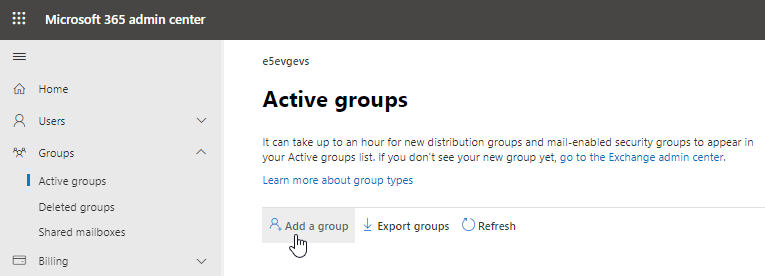
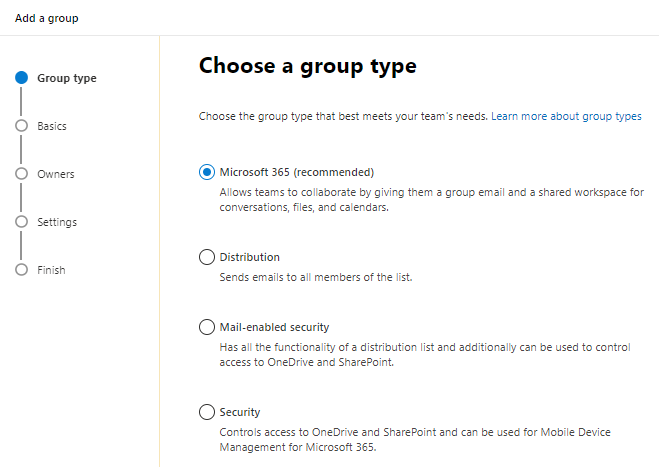
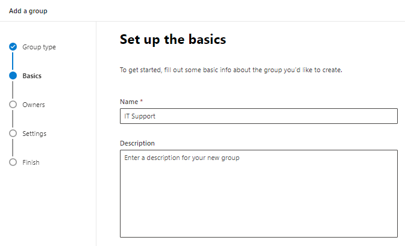
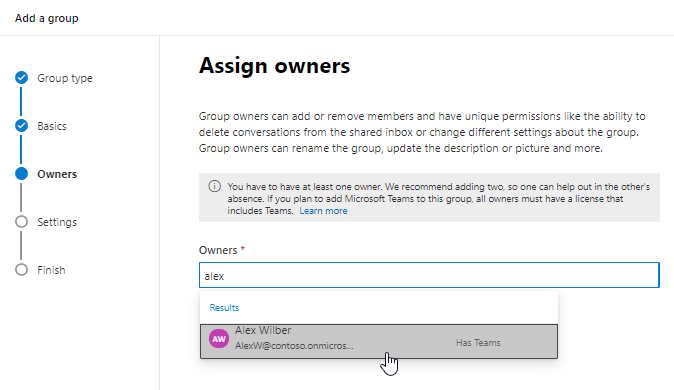
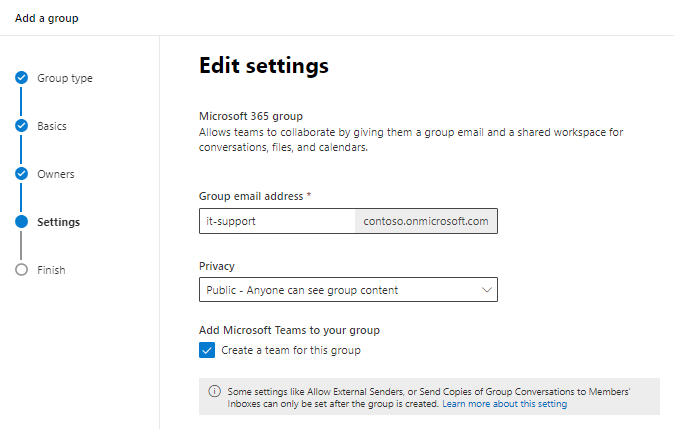
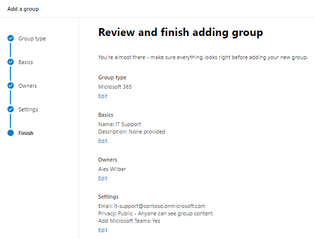
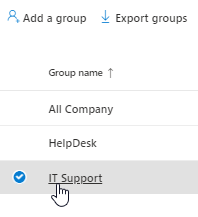
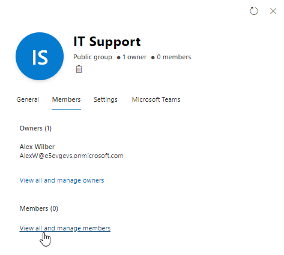
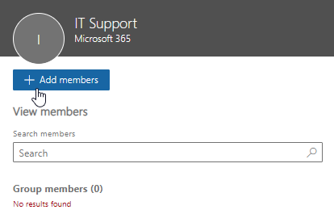
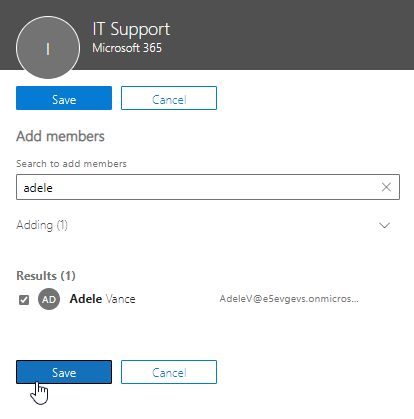
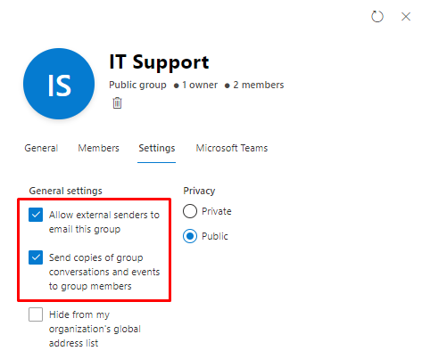
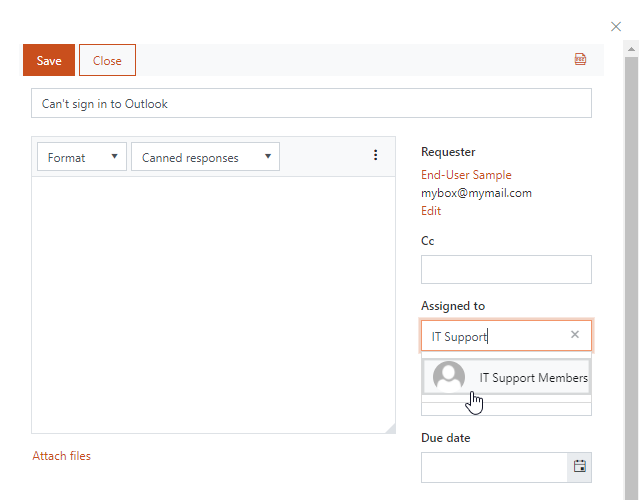

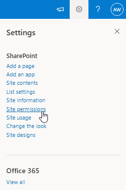
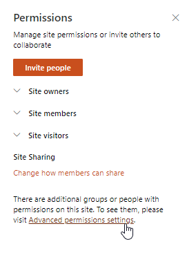
.. |createGroup| image:: ../_static/img/createGroup.jpg
   :alt: Create a group
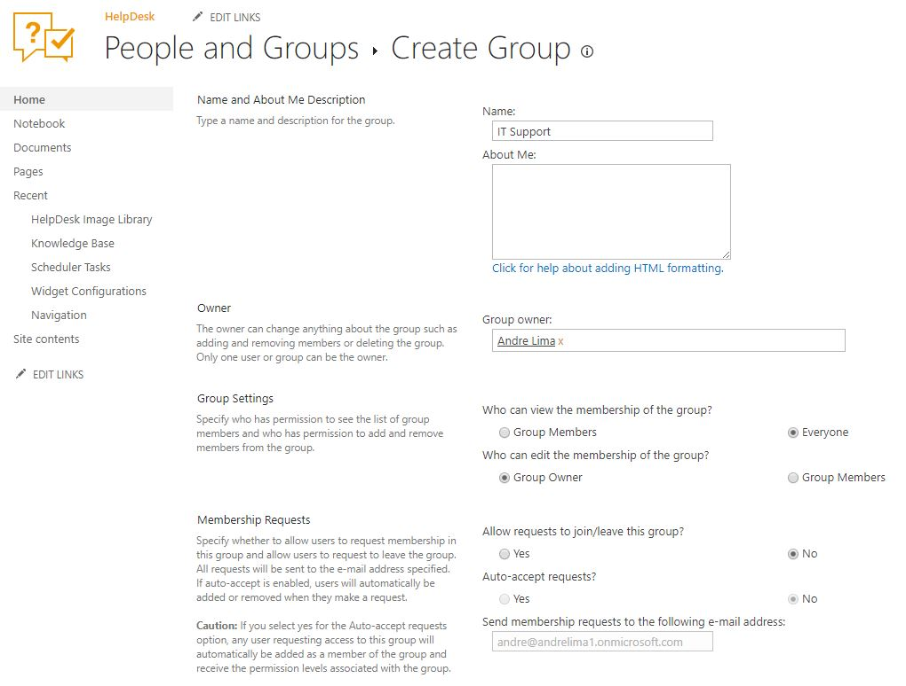
.. |groupPermission| image:: ../_static/img/group-permission.jpg
   :alt: Group permission level
.. |AddUsers| image:: ../_static/img/addUsers.jpg
   :alt:  Add new users
.. |groupDialog| image:: ../_static/img/group-dialog.jpg
   :alt:  Share pop up window
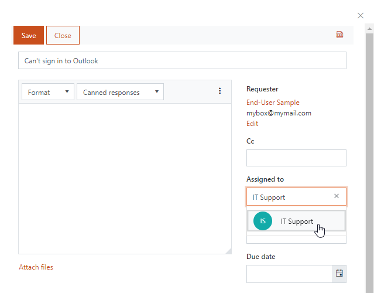