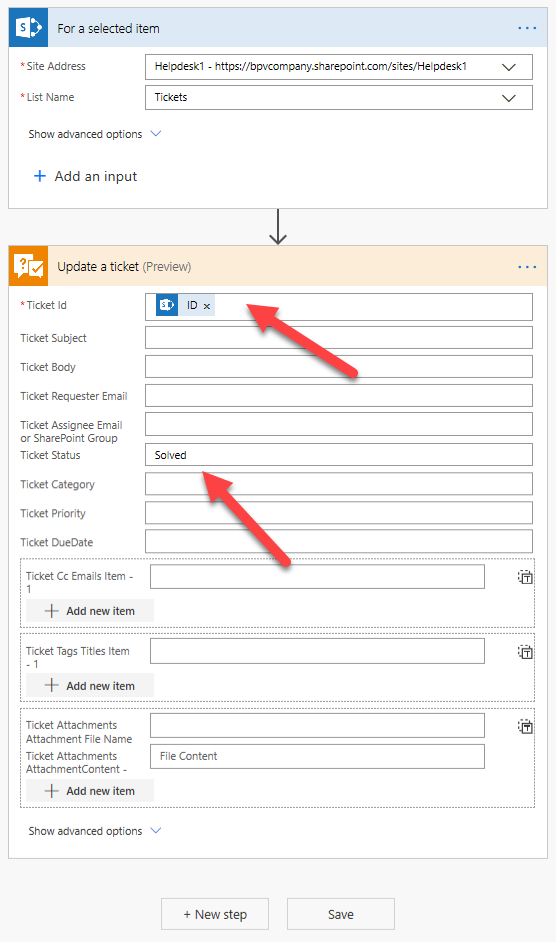

How to add quick actions to the context menu of tickets
##############################################################

Plumsail Helpdesk has `Microsoft Flow Connector`_ which helps you to manipulate data in your HelpDesk with the help of Microsoft Flow.
To start using it you need to `Create an API key`_ and  `Review available actions`_ .
In this article we'll work with PLumsail Helpdesk connector to add quick actions to the context menu of tickets, specifically to resolve a ticket without opening it.
Of course, you can use this approach for other scenarios. 

Creating API key
##############################################################
Let's create an API key in the Helpdesk settings

.. image:: ../_static/img/creating-api-key1.png
   :alt: Creating API key

.. image:: ../_static/img/test-key.png
   :alt: Test API key

We need to copy the API key and then use it in Microsoft Flow

.. image:: ../_static/img/test-key1.png
   :alt: Test API key

Creating flow
##############################################################
On this step we've already created MS Flow connection using our Helpdesk API key. 
Now we move further and create a flow which is going to resolve the tickets.

Then we can start the flow for selected ticket. Check it out

.. image:: ../_static/img/start-flow-for-selected-ticket.png.png
   :alt: Start flow

Creating flow
##############################################################

The same manner you can manage the tickets statuses depending on the situation and your goals.
Microsoft Flow and Plumsail Helpdesk connector is a power tandem which allows managing Plumsail helpdeks very efectively.

.. _Plumsail HelpDesk: https://plumsail.com/sharepoint-helpdesk/

.. _Microsoft Flow Connector: ../API/ms-flow.html

.. _Create an API key: ../API/get-api-key.html

.. _Review available actions: ../API/flow-actions.html