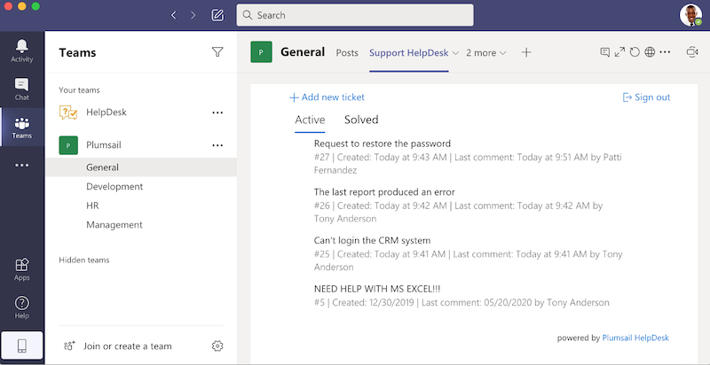

.. title:: Use Microsoft Teams with HelpDesk for SharePoint

Integrate HelpDesk for SharePoint in Microsoft Teams
####################################################

You can integrate HelpDesk into `MS Teams`_ so that your Office 365 users will not have to leave their preferred communication hub to work with the tickets.
In this article, we'll walk through inserting a HelpDesk tab to channels in MS Teams.
First, we'll insert a HelpDesk widget in an organization-wide channel for all the users of your Office 365 to be able to get support within the Teams interface:

|HelpDeskWidget|

Second, we'll create a Team for the Support agents to interact with the HelpDesk site and reply to the tickets:

|HelpDeskHome|

.. contents:: Table of contents
   :local:
   :depth: 1

Add Teams tab for submitting tickets
~~~~~~~~~~~~~~~~~~~~~~~~~~~~~~~~~~~~~

We'll start by creating an organizational team that will unite all the users in your Office 365 domain.
**Note** that you can build a HelpDesk tab for any Team with limited access in the same way.
Click on **Join or create a team** link below and then on the **Create a team** button.

|CreateTeam|

Choose **Build a team from scratch** option and then select **Org-wide**. Enter a new name and a description for your Team:

|TeamName|

You can easily insert a `HelpDesk Widget`_ as a tab in any Team. When a Team is created, a SharePoint Online Team Site is 
created to serve as a supporting resource. 

On the Team site, create a new page in the Pages library and place a HelpDesk widget on the page.

.. note::
   Please review `this article`_ on how to create and insert a Widget on a SharePoint site page. 

Now you can add your page as a tab to the Team. Select your team, click on the **"+"** icon on the tabs toolbar above.
Search for the SharePoint app: 

|SharePointApp|

You will see the list of all the pages on your Team Site. Please note that you can add any page within your SharePoint tenant as well.
Now, your users can interact with the HelpDesk widget without ever leaving Teams:

|Widget|

Add Teams tab for agents to work with tickets
~~~~~~~~~~~~~~~~~~~~~~~~~~~~~~~~~~~~~~~~~~~~~~

You can also create a Team for your HelpDesk agents. This way, each of the agents will work with the HelpDesk and reply to the tickets from within the Teams interface. 
There are several ways to create a new Team for your agents. If you have already created a HelpDesk site, you can create a new Team from the corresponding Office 365 group.
Alternatively, you can create a Private Team and add all the agents one by one.   

Click on **Join or create a team** link below and then on the **Create a team** button.

|CreateTeam|

Choose  **Build a team from scratch** option to create a new Private Team or **Create from...** and then **Microsoft 365 group**  to create a Team from an existing group. 
Now select your team, click on the **"+"** icon on the tabs toolbar above.
Search for the SharePoint app: 

|SharePointApp|

You will see the list of all the pages on your Team Site. If you have created a new group, you can add the HelpDesk **Home** page by URL. 
Navigate to the **Home** page of the HelpDesk site and copy the URL from the browser. 
Insert the page URL here: 

|AddPageByURL|

Now, your HelpDesk agents can create, view and reply to the tickets from the Teams tab. 
To open the HelpDesk site in the browser, just click on the Globe icon (**Go to website**).

.. |HelpDeskHome| image:: ../_static/img/online-how-two-teams-2.png
   :alt: HelpDesk Home page

.. |WidgetSettings| image:: ../_static/img/online-how-to-teams-9.png
   :alt: Widget Settings

   

.. _MS Teams: https://teams.microsoft.com/
.. _this article: ../Configuration%20Guide/Adding%20widget%20to%20SharePoint%20site.html
.. _HelpDesk Widget: ../Configuration%20Guide/Widget.html

