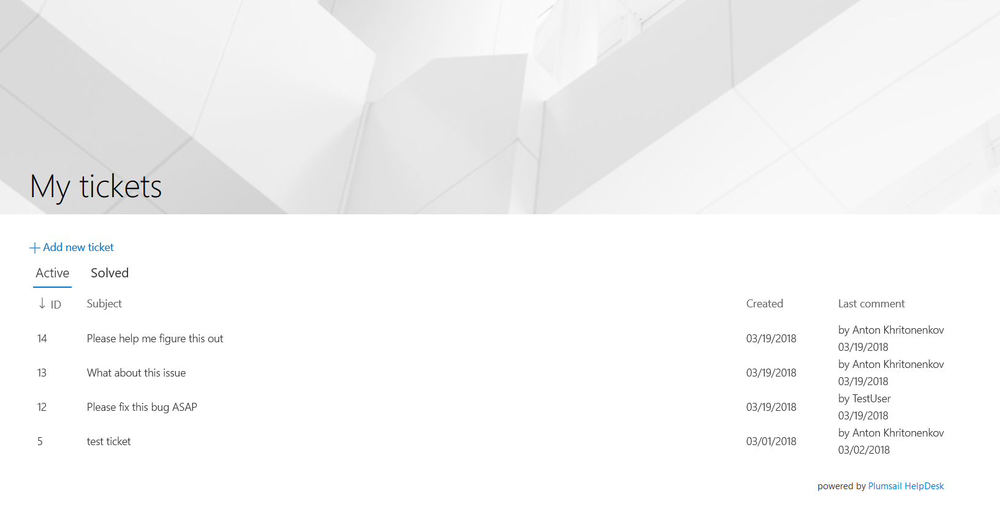
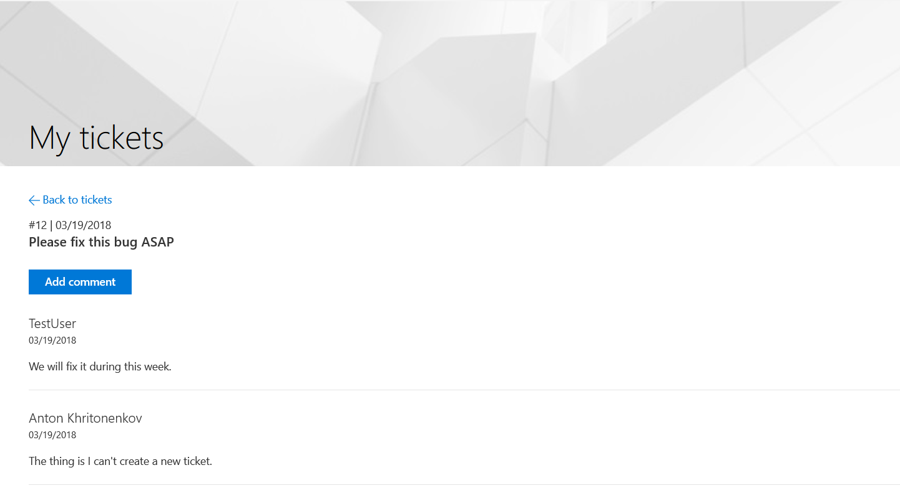

How to restrict requesters to see only tickets created by them using Plumsail HelpDesk in SharePoint Online 123
##############################################################

It is a very common task because in some cases you don’t want to allow requesters to see tickets for other requesters. Only agents should see all the tickets on HelpDesk site.

By default, `Plumsail HelpDesk`_ doesn’t assign unique permissions to each ticket. HelpDesk site can be used by anyone to create tickets or reply to them. If you want to change this behavior, you should restrict access to help desk site for non-agents and use HelpDesk widget as an interface for requesters instead. It displays only tickets that are created by the current user.

Thus, we can place Plumsail HelpDesk widget to some public page on our Intranet. You should place this page outside of Plumsail HelpDesk site and provide a link to this page for all requesters. For example, you might create this page in your main SharePoint site and call it "My tickets".

This is how the widget will look for a regular requester:

|WidgetView|

|WidgetTicketView|

Please review `this instruction`_ to understand how to place the widget on a page.

Pay attention to `this step`_ of installing add-in from SharePoint app store. It is required to allow the widget to automatically detect the current user (single sign-on). If you don't install it, the widget will ask requesters for login and password.

Now, all requesters will use this page with the widget as an entry point to your help desk. They should never navigate to the original help desk site. Let us learn how to restrict access to it.

Restricting access to the HelpDesk site
~~~~~~~~~~~~~~~~~~~~~~~~~~~~~~~~~~~~~~~

The only thing we need to do is to restrict access to the Plumsail HelpDesk site and allow access to agents only. 

Open your site and navigate to your Site Settings -> Site Permissions. If you are seeing this:

|CheckPermission|

It means that your help desk site is a root site of a site collection. You just need to remove permissions to this site for everyone except agents (technicians).

You can remove all permissions from this site, then click “Create Group” and call it “Agents”. Then add all agents to this group.

If you are seeing this:

|CheckPermissionSubsite|

Your site is a subsite and it inherits permissions from a parent site. You need to click “Stop Inheriting Permissions” to guarantee that your help desk site has unique permissions.

Then you can remove all permissions from this site, then click “Create Group” and call it “Agents”. Then add all agents to this group.

After following this instruction you should have a separate `Plumsail HelpDesk`_ site that is shared with your agents and another site with a page where requesters can see or create their own tickets. If you didn't install it yet, `download it`_ and follow the installation instruction for your version of SharePoint in the documentation. It is quite easy to get started.

.. |CheckPermission| image:: ../_static/img/site-collection-check-permission.png
   :alt: Plumsail HelpDesk manage site-collection permissions

.. |CheckPermissionSubsite| image:: ../_static/img/subsite-check-permission.png
   :alt: Plumsail HelpDesk manage subsite permissions

.. _Plumsail HelpDesk: https://plumsail.com/sharepoint-helpdesk/

.. _this instruction: https://plumsail.com/docs/help-desk-o365/v1.x/Configuration%20Guide/Adding%20widget%20to%20SharePoint%20site.html

.. _this step: https://plumsail.com/docs/help-desk-o365/v1.x/Configuration%20Guide/Adding%20widget%20to%20SharePoint%20site.html#enable-automatic-sign-in-for-a-widget

.. _download it: https://plumsail.com/sharepoint-helpdesk/download/