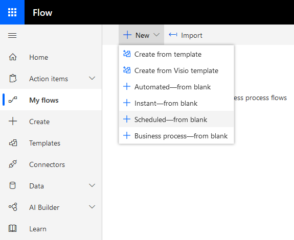
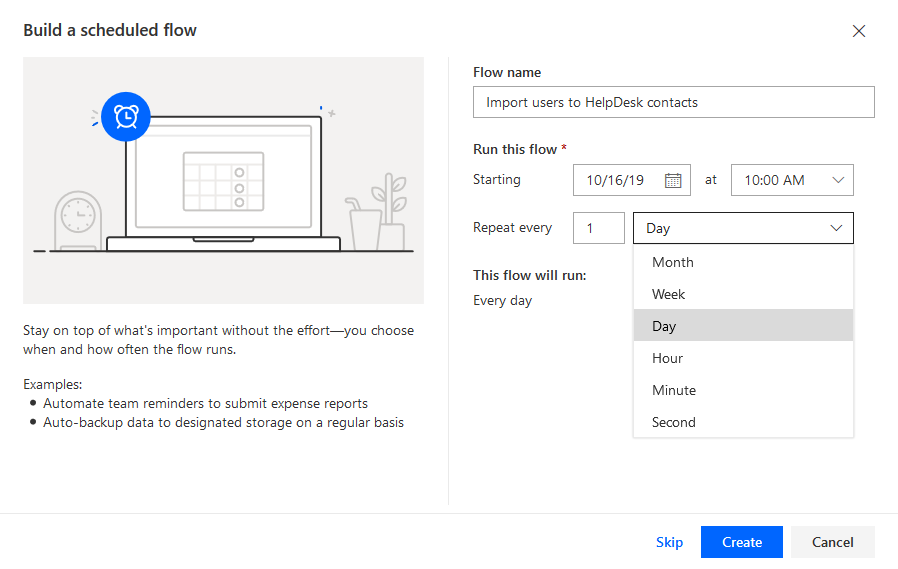

Import Office 365 Users into Contacts List of HelpDesk for SharePoint Online Using Microsoft Flow
#################################################################################################

Microsoft Flow is a universal tool for creating automated processes in which different apps and services can interact with each other.
Since `Plumsail HelpDesk`_ has got own connector_ for it with a bunch of actions_, it widens automation opportunities of a HelpDesk service based on our product.
In this article, I will review configuring of a flow for importing of Office 365 users into a HelpDesk contacts list.
Though each SharePoint user in your domain is added to it automatically once he/she creates a ticket of signs in to a HelpDesk site, you may need to have all users in the list regardless that condition.

First, sign in to a `Microsoft Flow`_ site and go to the list of flows.

|FlowList|

Then create a new scheduled flow. You may choose another type of the one or replace then trigger by another according to your needs.

|CreateNewFlow|

In a pop-up window, specify a name of the flow to be created and a schedule according to which you want to start the flow.
Click "Create."

|ConfigureSchedule|

After, you will ber redirected to a page for editing the flow. Here you can edit the trigger and add other actions to be performed.
Add a new step (action).

|NewStep|

Find "Office 365 Users" connector and choose it.

|OfficeConnector|

Then select "Search for users" action.

|SearchAction|

If you leave the "Search term" field empty, the action will return all users without filtering.
The "Top" field specifies how many first found users will be returned.
By default, it is assigned to 0—it means the action will return first 100 users.
To get more of them, specify a custom value in the field but it can't be more than 999 due to Microsoft restrictions.

.. note::
    If your organisation has more than 999 users, you need to modify the flow to get them piecemeal (e.g. by departments).

|SearchConfiguration|

Further, find a HelpDesk connector.

|HelpDeskConnector|

And then select a "`Create a contact`_" action.

|CreateContact|

Pass to the action dynamic data (output of the previous one), i.e. full name of a user and his/her E-mail.
Set "Update if exists" property to "Yes" so the action could update a contact if it already exists instead of creating a duplicate.
Note that the flow put the action in an "Apply to each" control so it will be repeated for each user found on the previous step.

|CreateContactConfiguration|

Now save the flow and that is all.
You can test it at once to ensure that the one works properly and not to wait the scheduled start.

|SaveFlow|

After you click "Test," choose the option according to which you will perform the trigger action and hit on a "Save & Test" button.

|SaveAndTest|

Run the flow.

|RunFlow|

And check its results.

|FlowResults|

As a result, the process of importing new users to teh list of contacts in HelpDesk is automated.

.. |FlowList| image:: ../_static/img/HowTo_ImportUsers_FlowList.png
   :alt: List of flows
   :width: 550

.. |NewStep| image:: ../_static/img/HowTo_ImportUsers_NewStep.png
   :alt: Create new scheduled flow
   :width: 650

.. |OfficeConnector| image:: ../_static/img/HowTo_ImportUsers_OfficeConnector.png
   :alt: Create new scheduled flow
   :width: 550

.. |SearchAction| image:: ../_static/img/HowTo_ImportUsers_SearchAction.png
   :alt: Create new scheduled flow
   :width: 550

.. |SearchConfiguration| image:: ../_static/img/HowTo_ImportUsers_SearchConfiguration.png
   :alt: Create new scheduled flow
   :width: 550

.. |HelpDeskConnector| image:: ../_static/img/HowTo_ImportUsers_HelpDeskConnector.png
   :alt: Create new scheduled flow
   :width: 550

.. |CreateContact| image:: ../_static/img/HowTo_ImportUsers_CreateContact.png
   :alt: Create new scheduled flow
   :width: 550

.. |CreateContactConfiguration| image:: ../_static/img/HowTo_ImportUsers_CreateContactConfiguration.png
   :alt: Create new scheduled flow
   :width: 750

.. |SaveFlow| image:: ../_static/img/HowTo_ImportUsers_SaveFlow.png
   :alt: Create new scheduled flow
   :width: 750

.. |SaveAndTest| image:: ../_static/img/HowTo_ImportUsers_SaveAndTest.png
   :alt: Create new scheduled flow
   :width: 300

.. |RunFlow| image:: ../_static/img/HowTo_ImportUsers_RunFlow.png
   :alt: Create new scheduled flow
   :width: 300

.. |FlowResults| image:: ../_static/img/HowTo_ImportUsers_FlowResults.png
   :alt: Create new scheduled flow
   :width: 550

.. _Plumsail HelpDesk: https://plumsail.com/sharepoint-helpdesk/
.. _connector: ../API/ms-flow.html
.. _actions: ../API/flow-actions.html
.. _Microsoft Flow: https://us.flow.microsoft.com/en-us/
.. _Create a contact: ../API/flow-actions.html#create-a-contact