Import Office 365 Users into Contacts List of HelpDesk for SharePoint Online Using Power Automate (Microsoft Flow)
#################################################################################################

Power Automate (Microsoft Flow) is a universal tool for creating automated processes in which different apps and services can interact with each other.
Since `Plumsail HelpDesk`_ has got own connector_ for it with a bunch of actions_, it widens automation opportunities of a HelpDesk service based on our product.
In this article, I will review configuring of a flow for importing of Office 365 users into a HelpDesk contacts list or for updating the latter.
In most cases, there is no need in such a synchronisation since HelpDesk adds contacts_ automatically when creating tickets on the basis of received E-mail messages or through a `web widget`_.
However, importing or updating contacts may be useful in cases when communication with customers occurs personally, by phone, etc. and in any case not via HelpDesk.
Automation of contacts processing can lighten the work of the support staff.

Import Office 365 Users into HelpDesk Contacts List
+++++++++++++++++++++++++++++++++++++++++++++++++++

First, sign in to a `Power Automate (Microsoft Flow)`_ site and go to the list of flows.

|FlowList|

Then create a new blank flow, name it and find a recurrence trigger.
It will allow you to start the flow by schedule.
You may choose another trigger or replace the one later according to your needs.

|Trigger|

Configure the trigger as you wish. The one on the screenshot below will start the flow every day at 10:15 (UTC) starting on 17 October 2019.

|TriggerConfiguration|

Add a new step (action).

|NewStep|

Find "Office 365 Users" connector and choose it.

|OfficeConnector|

Then select "Search for users" action.

|SearchAction|

If you leave the "Search term" field empty, the action will return all users without filtering.
The "Top" field specifies how many first found users will be returned.
By default, it is assigned to 0—it means the action will return first 100 users.
To get more of them, specify a custom value in the field but it can't be more than 999 due to Microsoft restrictions.

.. note::
    If your organisation has more than 999 users, you need to modify the flow to get them piecemeal (e.g. by departments).

|SearchConfiguration|

Further, find a HelpDesk connector.

|HelpDeskConnector|

And then select a "`Create a contact`_" action.

|CreateContact|

Pass to the action dynamic data (output of the previous one), i.e. full name of a user and his/her E-mail.
Set "Update if exists" property to "Yes" so the action could update a contact if it already exists instead of creating a duplicate.
Note that the flow put the action in an "Apply to each" control so it will be repeated for each user found on the previous step.

|CreateContactConfiguration|

Now save the flow and that is all.
You can test it at once to ensure that the one works properly and not to wait the scheduled start.

|SaveFlow|

After you click "Test," choose the option according to which you will perform the trigger action and hit on a "Save & Test" button.

|SaveAndTest|

Run the flow.

|RunFlow|

And check its results.

|FlowResults|

As a result, the process of importing new users to teh list of contacts in HelpDesk is automated.

Synchronisation of HelpDesk Contacts with Office 365 Users Profiles 
+++++++++++++++++++++++++++++++++++++++++++++++++++++++++++++++++++

When the task is not to add new contacts but keep the existing ones up to date, you can modify the flow to the following configuration.

If you want to check updates about user’s status once in a day, use the same recurrence trigger.

|NewStep|

Next, add an action for SharePoint.
It will get items from from the Contacts list of the SharePoint site on which HelpDesk is installed.
Once you have selected SharePoint, you will need to log in.
In advanced options you can filter query by role which equals to Member or Agent.

|GetItems|

After that, you need to configure "Apply to each" loop which makes possible to control the list that you repeat over.

|Loop|

Then add a "Get user profile" action for Office 365.

|GetUser|

As next step, add a new action which will update fields in Contacts list in SharePoint if there were some changes in user profiles in Office 365.
Note that "Is enabled" field was created manually.
You can find information how to create a new column `here`_.

|Update|

Don't forget to save the new flow.

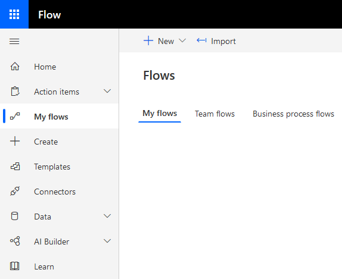

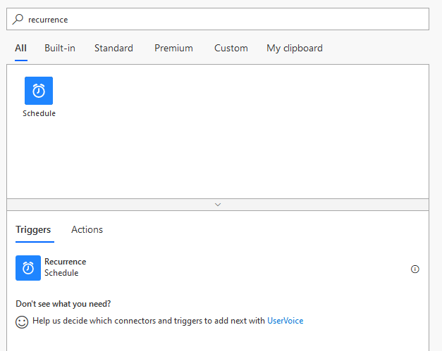

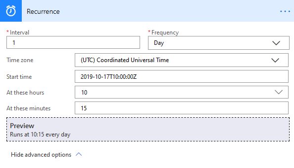

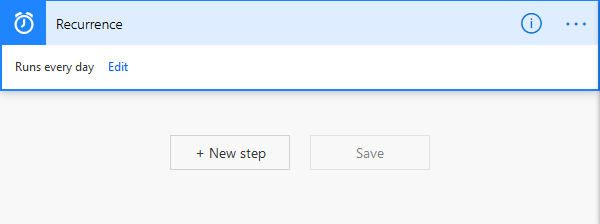

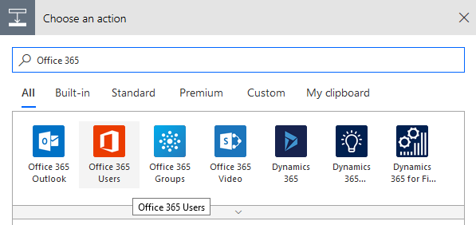

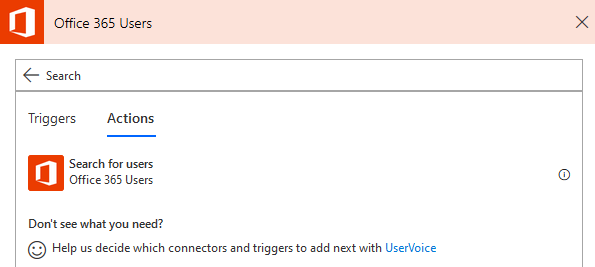

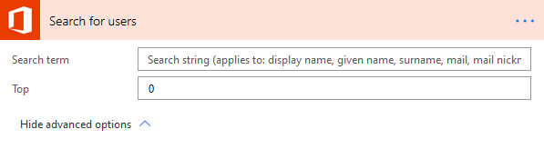

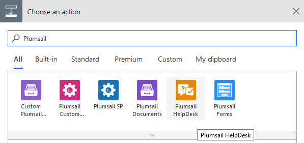

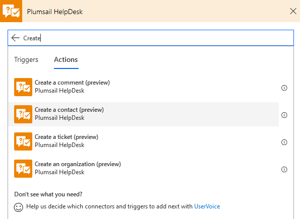

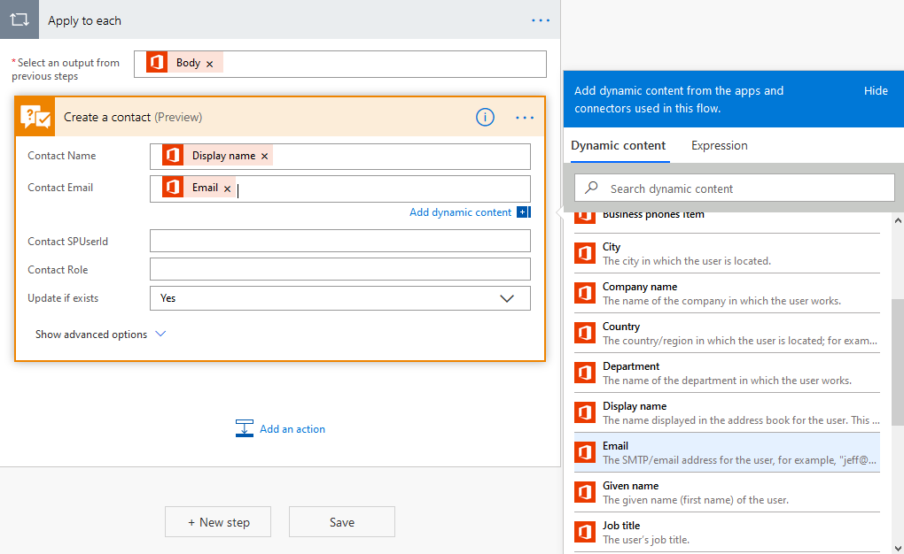

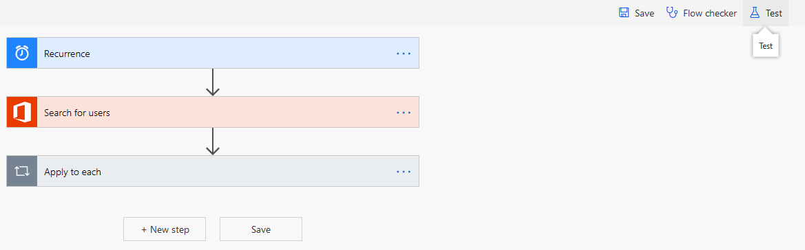

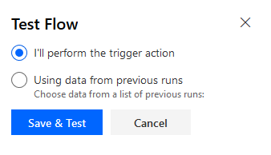

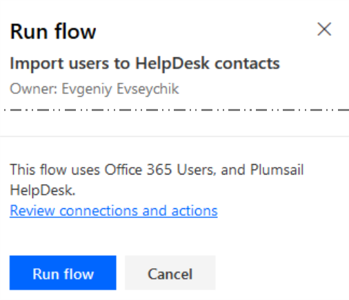

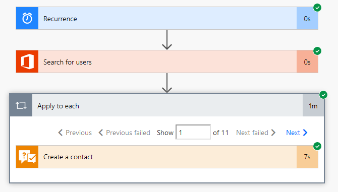

.. |GetItems| image:: ../_static/img/get-items-with-filter.png
   :alt: Get items

.. |Loop| image:: ../_static/img/apply-to-each.png
   :alt: Loop action

.. |GetUser| image:: ../_static/img/get-user-profile-office.png
   :alt: Get user profiles

.. |Update| image:: ../_static/img/update-items-in-contacts.png
   :alt: Update items

.. _Plumsail HelpDesk: https://plumsail.com/sharepoint-helpdesk/
.. _connector: ../API/ms-flow.html
.. _actions: ../API/flow-actions.html
.. _Power Automate (Microsoft Flow): https://us.flow.microsoft.com/en-us/
.. _Create a contact: ../API/flow-actions.html#create-a-contact
.. _contacts: ../User%20Guide/Contacts.html
.. _web widget: ../Configuration%20Guide/Widget.html
.. _here: https://plumsail.com/blog/2016/07/quick-tip-how-to-add-a-new-column-to-tickets-list-and-form-in-sharepoint-help-desk/