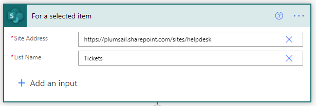

Manage permissions for the helpdesk site in SharePoint Online
##############################################################

 
There are two basic ways to manage permissions in Plumsail HelpDesk for Microsoft 365. 
You can restrict end-user permissions to their tickets only with the use of `web widget`_, and you can create separate working areas for your agents by installing separate 
HelpDesk sites. 

.. contents:: Contents
	:local:
	:depth: 1

Manage end-user permissions
~~~~~~~~~~~~~~~~~~~~~~~~~~~

As a general rule, you don’t want to allow requesters to see tickets for other requesters. 
This way, only the helpdesk agents and managers will have the access to the helpdesk site and the end-users will submit the tickets with `web widget`_ or email.
However, in some cases you can choose to make your help desk site available to all users from your organization.
You can choose either option during the installation:

|Installation|

If you choose to install the site as private (the default option), the site will be accessed my the members of a speciphic group only.

Now it's a good idea to place web widgets for other users both inside and outsite of your organizations to interact with the SharePoint helpdesk. 
Just navigate to the **Widgets** tab in **Settings** and create a new one: 

|NewWidget|

Please note that you can create as many web widgets as you like, each with a unique set of columns and views:

|CreateWidget|

This is how the widget will look for a regular requester:

|WidgetTicketView|

To see the complete instruction on the web widget, please follow `this article`_. 

Manage helpdesk sites and groups
~~~~~~~~~~~~~~~~~~~~~~~~~~~~~~~~

By default, when you install a new helpdesk site, a new MS group is created. 
Please add agents and helpdesk managers you want to give the access to the speciphic group.
On your HelpDesk site, click the Settings gear icon in the upper-left corner, then navigate to **Site Permissions**.
You will see the default group in the **Site members** section:

|SiteMembers|

Add your agents to the group here:

|ManageGroup|

Please note that adding to the SharePoint group will not assign a role to each member. To manage roles, please use the `Contacts list`_. 

If you have multiple teams in your Support department with their speciphic responsibilities (for example, each team manages its own product), a good idea is 
to install a separate Plumsail HelpDesk site for each team. 

Please note that you can have as many sites as you wish under a **single license** for HelpDesk for SharePoint online.
After that, you can create separate HelpDesk widgets for each site. 
Also, please note that you will need to manage the **email forwarding** for each of your sites separately. The possible options for that include
creating a separate helpdesk email or creating forwarding rules. For example, each email containing a speciphic key word may be forwarded to a speciphic HelpDesk site.
Please read more on `email forwarding`_ to proceed.  

Create and manage unique permissions
~~~~~~~~~~~~~~~~~~~~~~~~~~~~~~~~~~~~

There is no permissions restrictions for the site members by default. 
It means that all site members will have acceess to all tickets and comments.
This is **by design** as HelpDesk is built on top of SharePoint, and individual item level permissions management **is not** considered
a best practice by Microsoft.

However, in certain cases you may need to restrict access to a single ticket, for example, a one containing sensitive documents or info. 
In thic case, you can set up a Power Automate workflow to change the permission settings. 

For such a task, a separate tool, `Plumsail Actions`_, is required. Please note that this is a separate product by Plumsail with its own subscription. 

.. note::
   As described above, the item level permissions is not recommended by Microsoft. 
   Using this practice extensively may slow down the performance of your HelpDesk system. 

To manage item level permissions, please create a flow that will work on Item Selection:

|FlowTrigger|

First, we'll get all the comments for the current ticket with the help of the Power Automate connector (see the the documentation on the `Power Automate connector`_).
After that, we use Change Permissions action from Plumsail Actions to remove all the permissions for the item and add the permissions back for one speciphic user.
Please note that you can also make the user populated automatically to restrict the access to the ticket Requester or assignee. 

|Flow1|

Now the access to this ticket is restricted. Though you can leave the flow as it is, you can go further and restrict the access to all comments of that ticket. 

|Flow2|

Please note that to make the flow visible on the HelpDesk site, you need to share it with SharePoint:

|Share|

After that, you will have an option to run the flow directly on a single ticket from your HelpDesk site:

|Run|

.. |NewWidget| image:: ../_static/img/permissions2.png
   :alt: Create new widget

.. |WidgetView| image:: ../_static/img/requester-widget-view.png
   :alt: Run the flow on a ticket

.. |WidgetTicketView| image:: ../_static/img/requester-widget-ticket-view.png
   :alt: Plumsail HelpDesk widget's ticket

.. _Power Automate connector: https://plumsail.com/docs/help-desk-o365/v1.x/API/ms-flow.html   

.. _Plumsail Actions: https://plumsail.com/actions/

.. _Contacts list: https://plumsail.com/docs/help-desk-o365/v1.x/Getting%20Started/Quick%20HelpDesk%20configuration.html#create-agents

.. _email forwarding: https://plumsail.com/docs/help-desk-o365/v1.x/Configuration%20Guide/Email%20settings.html

.. _web widget: https://plumsail.com/docs/help-desk-o365/v1.x/Configuration%20Guide/Widget.html

.. _this article: https://plumsail.com/docs/help-desk-o365/v1.x/Configuration%20Guide/Widget.html

.. _this instruction: https://plumsail.com/docs/help-desk-o365/v1.x/Configuration%20Guide/Adding%20widget%20to%20SharePoint%20site.html

.. _this step: https://plumsail.com/docs/help-desk-o365/v1.x/Configuration%20Guide/Adding%20widget%20to%20SharePoint%20site.html#enable-automatic-sign-in-for-a-widget

.. _download it: https://plumsail.com/sharepoint-helpdesk/download/