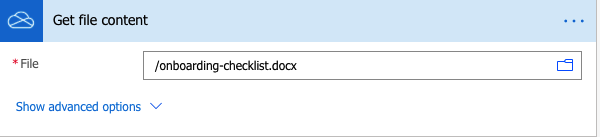

Use HelpDesk with Microsoft Teams for employee onboarding
#########################################################

A good onboarding experience can help you set your new hires up for success from the get-go. This is especially relevant when your team or its part is working remotely and you can't easily guide the new employee in person.
In this article, we'll take a look at a couple of tricks you can use to partially or fully automate the process with the help of Plumsail HelpDesk, MS Teams, and Power Automate.

#. `Trigger the onboarding process with MS Teams`_
#. `Use HelpDesk MS PowerAutomate connector for onboarding process`_
#. `Send messages to MS Teams chat and channel`_
#. `Complete flow`_

Trigger the onboarding process with MS Teams
~~~~~~~~~~~~~~~~~~~~~~~~~~~~~~~~~~~~~~~~~~~~~~~~~~~~~~~~~~~~~~~~

`MS Teams`_ is a a communication and collaboration hub for the users of your Office365 tenant to chat, hold video meetings, share files, etc.  
`Power Automate (formerly Microsoft Flow)`_ is a flexible instrument for creating automated processes. It can help integrate 
different services and make them interact with each other. Plumsail Helpdesk has a connector_ to interact with 
Power Automate that help you automate routine and repetitive actions. 

When you add a user to a particular MS Team, you can use it as a trigger to start a Powe Automate flow. 
Sign in to a Power Automate site (or create an account) and navigate to "My Flows".

Then create a new Flow, choose the type as **Automated from blank**. 

|NewFlow|

Name it and find a trigger from the MS Teams connector:

|Automated|

In the trigger action, pick up the correct team that you've added the new user to:

|Trigger|

This action will yield User Id - an identification that we can use to locate all the user's data that we might need. 
Just add a **Get user profile** action from the **Office 365 users**  connector and use the User Id to get it:

|Office365|

Additionally, we will need a prepared Checklist with the company resources, documents, and info that your new employees need to be provided access. 
You can store the checklist as a separate file. We'll use the OneDrive connector to get it, but you can use any connector you want. MS Power Automate supports SharePoint, Google Drive, DropBox, and other popular Cloud services.

|OneDrive|

Use HelpDesk MS PowerAutomate connector for the onboarding process
~~~~~~~~~~~~~~~~~~~~~~~~~~~~~~~~~~~~~~~~~~~~~~~~~~~~~~~~~~~~~~~~
Plumsail HelpDesk has its own connector to work wit Power Automate. To use it, you need to only to navigate to the **Power Automate & API** tab on the **Settings** page
and create a new API key. Please give it a name and choose **Edit** permissions level. Copy the key:

|Key|

.. note:: 
    You can find more info on how to use the HelpDesk Power Automate connector in a `separate article`_.

After this, you can add the **Create a ticket** action.
We will use this to create a HelpDesk ticket with IT Department to provide the new employee all the necessary access to the company resources. Additionally, you can add as many tickets as you want in a single flow: you might also want to contact the HR Department to provide some orientation info, Security for the building pass, etc.
For this, we'll only need to know the emails of the employees (or groups) responsible for the process. 
Here's how a template of such a ticket might look like:

|Ticket|

Please note that we've used all the info dynamically from the previous step and only the ticket assignee (the IT service desk in this case) is hardcoded. We've also used the following Expression to set the ticket due date to tomorrow:  "addDays(utcNow(),1)".

Send messages to MS Teams chat and channel
~~~~~~~~~~~~~~~~~~~~~~~~~~~~~~~~~~~~~~~~~~

Finally, you may use MS Teams to send a message to your new colleague and notify other Team members of the reinforcement. 
First, we'll use the **Post a message as the Flow bot to a user** action to not let the user miss the ticket. This step might be a bit excessive as the employee will get the notification email from the HelpDesk anyway.

|Chat|

Note that, like in the previous steps, all the necessary info is acquired dynamically. The **Create a ticket** action yields all the info about the ticket we might need.

We'll also post a message in the **General** Team chat for others to greet the new colleague:

|Channel|

Complete flow
~~~~~~~~~~~~~

You will find the complete flow picture with all the settings below:

|Trigger|
|Arrow|
|Office365|
|Arrow|
|OneDrive|
|Arrow|
|Ticket|
|Arrow|
|Chat|
|Arrow|
|Channel|

.. |Office365| image:: ../_static/img/online-how-tp-onboarding-office365.png
   :alt: Get user profile

   

.. _MS Teams: https://teams.microsoft.com/
.. _connector: ../API/ms-flow.html
.. _Power Automate (formerly Microsoft Flow): https://flow.microsoft.com
.. _Use MS Teams to trigger the onboarding process in Power Automate: #trigger-the-onboarding-process-with-ms-teams
.. _Use HelpDesk MS PowerAutomate connector for onboarding process: #use-helpDesk-ms-powerautomate-connector-for-the-onboarding-process
.. _Send messages to MS Teams chat and channel: #send-messages-to-ms-teams-chat-and-channel
.. _Complete flow: #complete-flow
.. _separate article: ../API/ms-flow.html