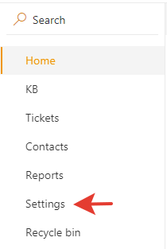

How to return to Classic UI
#####################################################

.. warning::

    All new features and fixes will be implemented only for Modern UI.
    
    We don't recommend to return to the Classic UI without the need.

#. Navigate to settings using the navbar:

     |SettingsLink|

#. Click on the “Appearance” tab and uncheck "Use Modern UI".

     |CheckBox|

#. To restore default forms please follow `this instruction <https://plumsail.com/docs/help-desk-o365/v1.x/Configuration%20Guide/Ticket%20and%20contact%20forms%20customization%20(before%202.1.1).html#restore-default-forms>`_

