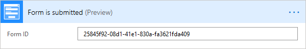
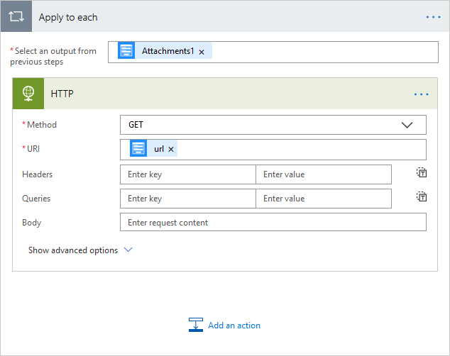
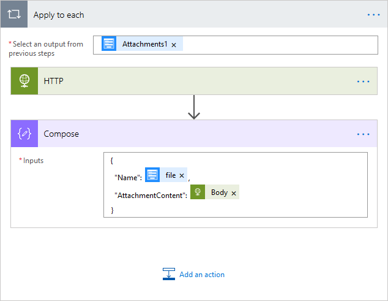
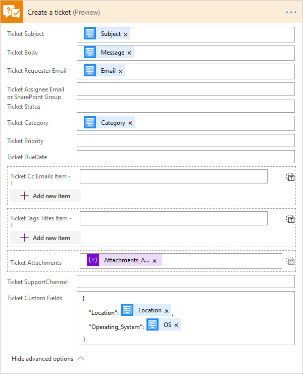
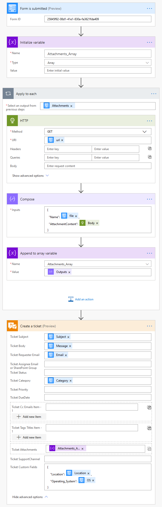
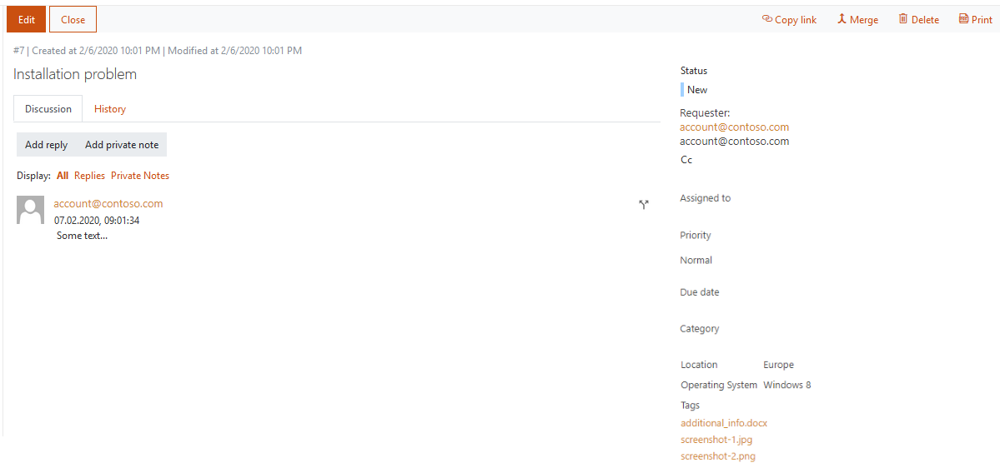

How to submit tickets from an online form to SharePoint HelpDesk with the help of Microsoft Flow or Azure Logic Apps connector
##############################################################

One of a simple ways to improve communication with clients or within a company is to create a custom form that can be used to send a feedback, to report a problem, to request assistance or just to get some information in general.

In this example, we will design a form for customers for submitting messages and use Plumsail HelpDesk connector in Microsoft Flow to create a new ticket in Plumsail Helpdesk for Office 365.

This is an example of the form that will create a ticket:

|FormPreview|

Design a form
~~~~~~~~~~~~~

First, design a form. We will do it with help of Plumsail Forms, but you can use any other forms solution that can submit data to Microsoft Flow.

Think about what information might need to be specified: a subject for the ticket, request’s category, customer’s location, operation system, etc.

Don’t forget to include the Submit button, so the form can be actually submitted. Flow only starts operating once the form is submitted.

This short article gives a better understanding of how to work with Plumsail Forms.

Here’s a simple form designed to receive messages from customers:

|SimpleForm|

Once you design and save the form, place it on a page where you would like the form to appear. You may add it to your public website or a page in SharePoint Online in Office 365.

Configure the Flow  —  First steps
~~~~~~~~~~~~~~~~~~~~~~~~~~~~~~~~

Here, I will guide you step by step through creating the flow. You also will find a screenshot of the complete flow at the end of the article. 

First, open Microsoft Flow, go to My Flows, click Create from blank to create a new Flow, search for and add Plumsail Forms — Form is submitted. 

Next, you need to fill in Form ID. You can find the Form Id in the Plumsail Forms if you click the Flow button. Alternatively, you can always check it in your Plumsail account.

|FormIsSubmitted|

We need to somehow parse JSON received from form submission to use it in the ticket creation step. Click Add an action and search for Data Operations — Parse JSON. 

Here, you’ll need to click on Content field and select Body from menu on the right. Next, go to Flow in the designer, copy form’s schema and insert it into the Schema field:

|SchemaField|

Don’t forget to save the form first, if you’ve added some changes, that will update the schema.

|ParseJSON|

Configure the Flow  —  Handling attachments
~~~~~~~~~~~~~~~~~~~~~~~~~~~~~~~~~~~~~~~~~

We need to prepare an array of attachments, that we will put in Plumsail HelpDesk — Create a ticket action when composing the ticket.

Add a new action and search for Variables — Initialaze variable action. Enter a name for the variable and choose the Array type for it.

|InitializeVariable|

Now, you need to add HTTP — HTTP action to download files from the Urls created on the form submission.
 
In the opened window select GET in Method dropdown field and add url to the Uri field. This will automatically transform this action into repeating one which will be performed for each file in Attachments.

It should look like this as a result:

|HTTPAction|

Now, inside of the loop, add Data Operations — Compose action.

Enter an element of the array into the Inputs as shown in the screenshot below. We will reference it in the next action.

|ComposeData|

Add Variables— Append to array variable action and append here the output from the Compose operation:

|AppendToArray|

The array of attachments is ready, now we can move to the last step — creating a ticket in our HelpDesk.

Configure the Flow  —  Create a ticket
~~~~~~~~~~~~~~~~~~~~~~~~~~~~~~~~~~~~

We will use Plumsail HelpDesk  —  Create a ticket action. 

Plumsail HelpDesk connector allows you to work with Plumsail HelpDesk with the help of Microsoft Flow.

.. important::

  This action is not available in public connector in Microsoft Flow yet. It will become available soon. If you want to use this action right now, you can `add this connector as a custom connector`_.

Add Plumsail HelpDesk — Create a ticket action and use fields from the form to compose the ticket. 

Add the Array of result files we received in the loop to the Ticket Attachments field and click Show advanced options to add JSON schema with custom fields.

|CreateTicket|

Finally, press Save Flow, unless you want other actions to take place after an email is sent.

So, here is the complete flow:

|CompleteFlow|

Final Result
~~~~~~~~~~~~

Here is a preview of my form. I have filled in some information to serve as an example and clicked Submit:

|FormPreview|

And here is the ticket in our Helpdesk, automatically created by HelpDesk — Create a ticket action:

|HelpDeskTicket|

That is it. These simple steps will help you to improve communication with clients or within your company.

.. |FormPreview| image:: ../_static/img/form-preview.png
   :alt: Plumsail form to create a ticket

.. |InitializeVariable| image:: ../_static/img/initialize-variable.png
   :alt: Initialize Array Variable

.. _add this connector as a custom connector: https://plumsail.com/docs/help-desk-o365/v1.x/API/create-custom-connector.html

