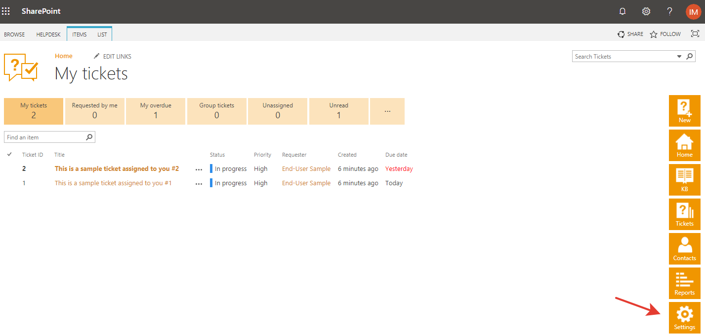
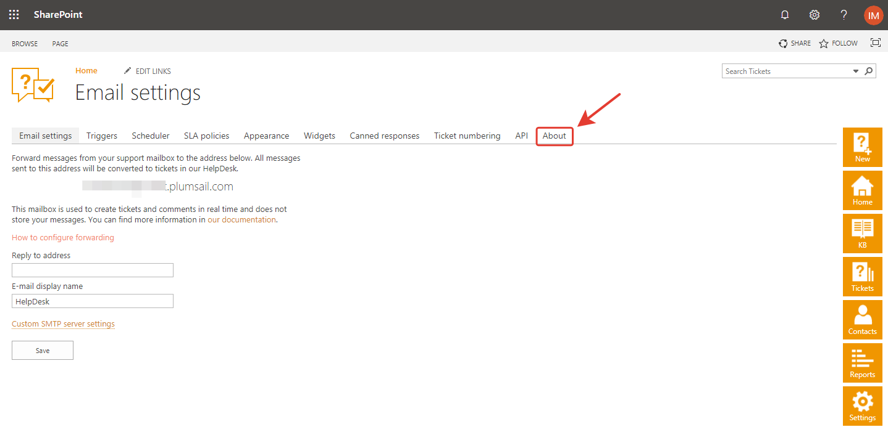
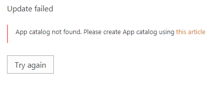

How to upgrade to 2.1.1
#####################################################

Navigate to settings using the icon in the navbar:

|SettingsIcon|

Go to "About" tab

|AboutTab|

Click "Update" and confirm you want to update.

|Update|

|Confirm|

HelpDesk will check the following requirements:

App catalog should be created. 
============================== 

If there is no app catalog created yet, you will see the following error:   

|AppCatalogError|
    
This error can be solved manually using `this article <https://social.technet.microsoft.com/wiki/contents/articles/36933.create-app-catalog-in-sharepoint-online.aspx>`_

"Plumsail HelpDesk" app should be deployed to the tenant app catalog.
================================================================== 

If "Plumsail HelpDesk" app not found in the app catalog, 
you will be asked for tenant admin credentials:

|CredentialsRequired|

To automatically deploy "Plumsail HelpDesk" app in the app catalog, 
please enter tenant admin credentials and click "Update".

If you don't want to enter the credentials, please do the steps described in this article: :ref:`upload-helpdesk-sppkg`.
and click "Update" again.

.. |Update| image:: ../_static/img/upgrade-2-1-1/upgrade211_step3.png
   :alt: Update
.. |Confirm| image:: ../_static/img/upgrade-2-1-1/upgrade211_step4.png
   :alt: Confirm

.. |CredentialsRequired| image:: ../_static/img/upgrade-2-1-1/upgrade211_credentials.png
   :alt: Credentials required
