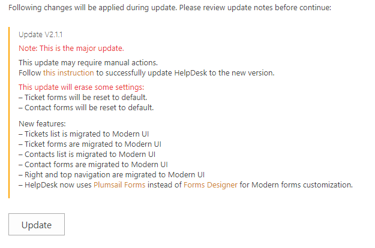
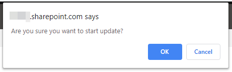
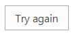
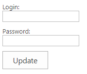

How to upgrade to 2.1.1
#####################################################

This is major update. Most of UI parts will be changed from Classic to Modern.

New features:

- Tickets list is migrated to Modern UI
- Ticket forms are migrated to Modern UI
- Contacts list is migrated to Modern UI
- Contact forms are migrated to Modern UI
- Right and top navigation are migrated to Modern UI
- HelpDesk now uses `Plumsail Forms <https://plumsail.com/forms/>`_ instead of `Forms Designer <https://plumsail.com/sharepoint-forms-designer/>`_ for Modern forms customization.

This update will erase some settings:

- Ticket forms will be reset to default.
- Contact forms will be reset to default.

.. note:: 
    You can switch your UI back to Classic after update.

    Please read this article for more details: :ref:`back-to-classic`
    

Navigate to settings using the icon in the navbar:
|SettingsIcon|

Then click on the “About” tab. Now you can see available updates.

Click "Update" and confirm you want to update.

|Update|

|Confirm|

HelpDesk will check the following requirements:

App catalog should be created. 
============================== 

The app catalog is used to install the Sharepoint Framework solution (SPFx).

SPFx adds Modern UI features to your HelpDesk.

If there is no app catalog created yet, you will see the following error:   

.. error::
    App catalog not found. Please create App catalog using `this article <https://social.technet.microsoft.com/wiki/contents/articles/36933.create-app-catalog-in-sharepoint-online.aspx>`_.

Create app catalog and click "Try again":
|TryAgain|
    

"Plumsail HelpDesk" app should be deployed to the tenant app catalog.
================================================================== 

If "Plumsail HelpDesk" app not found in the app catalog, 
you will be asked for tenant admin credentials:

|CredentialsRequired|

To automatically deploy "Plumsail HelpDesk" app in the app catalog, 
please enter tenant admin credentials and click "Update".

.. note::
    If you don't want to enter the credentials, please do the steps described in this article: :ref:`upload-helpdesk-sppkg`
    and click "Update" again.

.. |SettingsIcon| image:: ../_static/img/settingsicon.png
   :alt: Settings Navigation Icon

