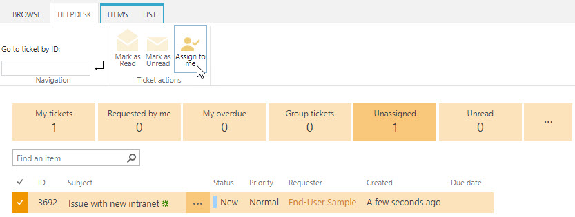
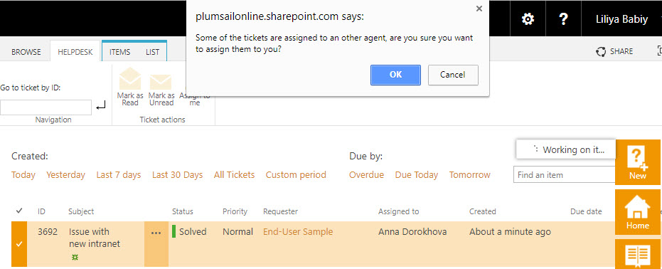

Assign to me
############

Assign to me button gives you opportunity easily assign Tickets to yourself with one click.

|AssignToMe|

To assign tickets, choose one or several unassigned tickets. Then click on Helpdesk tab and select “Assign to me”. After that, you will find newly assigned tickets on My tickets tab. This action can be reverted. 
If the ticket has been assigned to somebody else, you can reassign it with Assign to me button as well.

|AlreadyAssigned|

