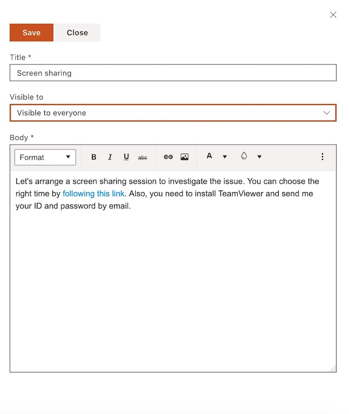
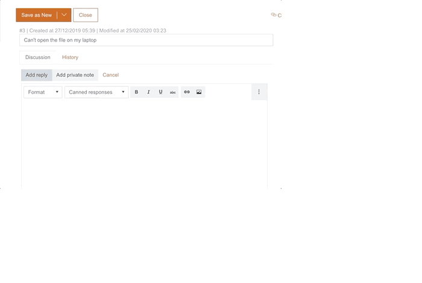
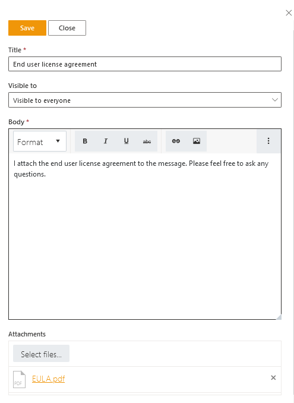
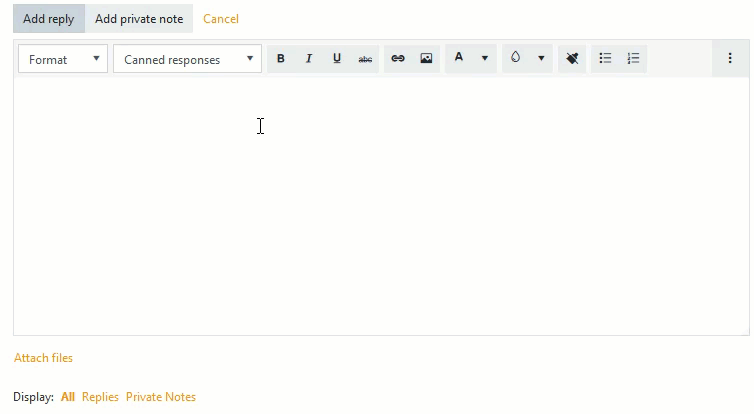

Canned responses
################

Respond to common questions faster with canned responses. Your agents can create a predefined set of reply templates 
that they can send out with a single click.  
Navigate to **Settings** using menu on the left.   

|HDSettingsCannedResponces|

Click on “Canned response” tab. Here you can find all canned responses which were created on this HelpDesk instance. 

|CannedResponces|

To create a new canned response, click on **New Canned Response**.
Provide a title that you and your agents will easily understand and type your response template in the rich text editor. 
Also, you can set the visibility. If you leave **Visibility to everyone**, every user can view it and use it in responses.
If you choose **Visible to me** from the dropdown list, you will be the only user of that template.

|NewTemplate|

Click save and now you can add canned response to your reply to the ticket. The Canned responses is the little box with drop-down inside text editor. When you clicked on it, it will display the list of available canned responses and you can browse through them. 
Choose the response you'd like to add to your reply and that’s it.

|CannedResponseInAction|

Note that you can create a new canned response straight from the ticket. Just click on the **Add new** button on top of the **Canned responces** dropdown list. 
 

Additionally, you can add attachments to your canned response.

|CannedResponseWithAttachment|

After selecting the canned response the attachments will be added to the ticket.

|SelectCannedResponseWithAttachment|

