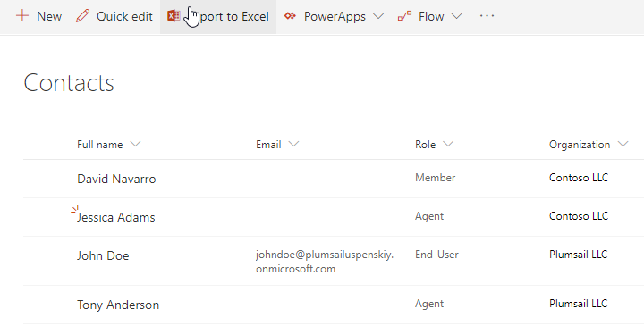
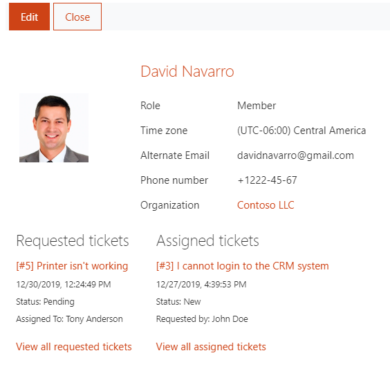
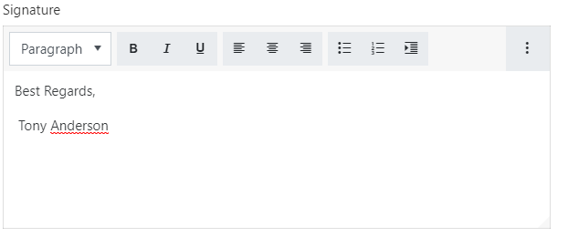

Contacts
########

Contacts is a directory of persons that HelpDesk is aware of. There are
three predefined contact roles:

Agent
   SharePoint user that processes tickets.

Member
   SharePoint user that creates tickets.

End-User
   User without SharePoint account who creates tickets by email.

Navigate to Contacts using the navigation menu. 
Use the “Contacts” list to manage information about everyone who
operates HelpDesk. End-Users and Members are created automatically when
a new ticket is received by email. If the requester has a SharePoint
account it is assigned a Member role, if the requester doesn’t have a SharePoint
account, it is assignd an End-User rol. And you have to manually add all agents
who work with HelpDesk.

|contacts_1|

Click on the contact's name to open full details form. 
You will see a card of the contact with the information about
organization, email address, phone number, role, and time zone. There
are also two views with recent tickets related to current contact:

Requested tickets
   Recent tickets that were requested by the contact.

Assigned tickets 
   Recent tickets that current contact is an assignee of.

.. note::
   The views are visible only if there are tickets related to the current contact.

|david_navarro|

Additional information about the contact contains:

Organization
   Look up to Organizations list item. You can create a new organization without leaving the currently opened form by
   clicking “Add new”.

Role
   Defines the role of the current person on the HelpDesk site:
   
   Agent
      SharePoint user who processes tickets.

   Member
      SharePoint user who creates tickets.

   End-User
      User without a SharePoint account who creates tickets by email.

SharePoint user/Email
   Either one is displayed, depending on the
   current person’s role. If the contact is an agent or a member – his or her name
   becomes a link to the SharePoint user page, otherwise, the Email is
   displayed.

Signature
~~~~~~~~~

Each agent can have a signature which will automatically appended when the agent clickes on **Add reply**
 button on the ticket form.

To setup agent signature you shoul navigate to agent contact and edit "Signature" field.

|SetupSignature|

