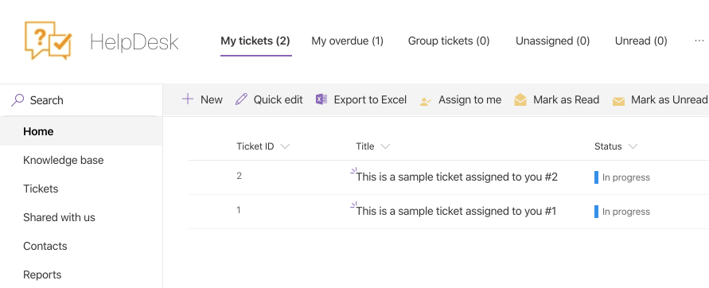
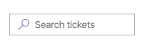
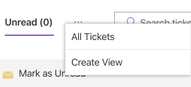
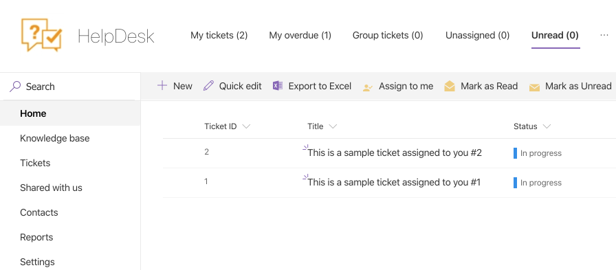

Home
####

This is the home page where agents process their tickets. This section
contains tickets that are related to the current agent only. Navigate to
home page using the navigation bar.

Home views
~~~~~~~~~~

You can navigate to several built-in views using links in the home navigation bar at the top of the
page. There is a counter of tickets below each link.

All new and updated tickets are auto marked as unread. An example of
such ticket is shown below:

|home|

.. note::
	Unread tickets are displayed as unread for the assignee only.
	
Bold typing is used in “My tickets” and “My overdue” views only.

Here is the list of built-in views:

My tiсkets 
	All tickets assigned to you. (Tickets that have you specified in the “Assigned to” field).

Requested by me
	All tickets requested by you. (Tickets that have you specified in the “Requester” field).

My overdue 
	Tickets assigned to me with Due date before today.

Group tickets 
	Tickets assigned to SharePoint groups that I belong to. (You can assign tickets to SharePoint groups, e.g., ”IT Support”).

Unassigned 
	All tickets with an empty “Assigned to” field.

Unread 
	All unread tickets assigned to you.

Resolved tickets are not displayed in any of the home views.

To the right of the links on the top, there is a search bar.  Use it to navigate to ticket by id.
Just type ID and hit Enter:

|search bar|

How to add a new view
~~~~~~~~~~~~~~~~~~~~~

You have several standard SharePoint ways to create your own custom
view. To simplify your work we added this option to the home navigation.
Just click **"..."** button in home navigation and select “Create view”.
All views you created are displayed under **"..."** menu.

|create view|

Mark tickets as read or unread
~~~~~~~~~~~~~~~~~~~~~~~~~~~~~~

When a ticket is created or updated it is marked as unread for the
assignee. All unread tickets are displayed with bold typed titles and IDs in “My tickets” and “My overdue” views. There is also a separate
Unread view, where the agent can see all unread tickets.

You can mark tickets as read or as unread manually. Select single or
multiple tickets in the view, switch to “HelpDesk” tab in the ribbon and
click “Mark as Read” or “Mark as Unread” button:

|Mark as Read|

.. |home_icon| image:: ../_static/img/home_icon.png
   :alt: Home Navigation Icon

