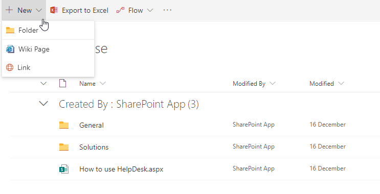

Knowledge base
##############

Use the knowledge base to store answers to the most common questions. It
is possible that somebody already answered the similar question earlier. You
can check knowledge base before answering the question.

Navigate to all tickets using the the navigation menu.
You will see two sample category folders “Solutions” and “General”. They
were created during HelpDesk installation. You can navigate to any of
them and add new articles.

To create a new article click **New** and  select **Wiki Page**:
To create a new folder click **New** and select  **Folder**.

|create-kb-article|

