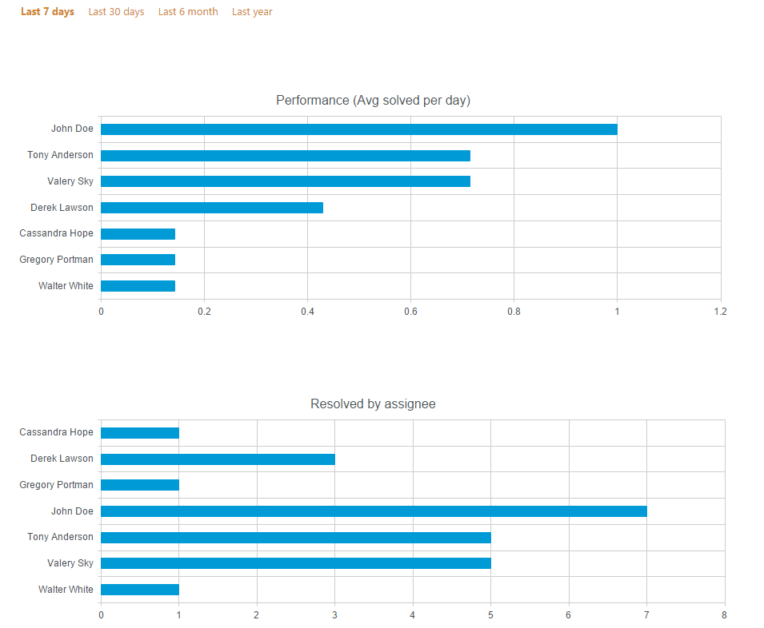

Reports
#######

In this section, you are able to create diagrams based on all tickets,
requesters, and agents. Here you can analyze efficiency and intensity of
HelpDesk usage, personal productivity of each agent, find most active
requesters and do other kinds of information analysis with your HelpDesk
data.

Go to Reports by clicking the appropriate button in the navbar:

|reports-icon|

On all pages (except “Overview”) you can apply quick date filters to
only show data in the last: 7 days, 30 days, 6 months, year.

You can modify charts using `Dashboard Designer`_. It is another
Plumsail product with a separate pricing.

Overview
~~~~~~~~

It is a dashboard representing all HelpDesk tickets. The dashboard
consists of four charts:

Tickets by state 
   Shows how many unassigned, overdue, in progress
   and new tickets are created.

Tickets by category 
   Shows how many tickets are created within a
   specific category (Ticket field “Category”).

Tickets by agents 
   Shows how many overdue and non-overdue tickets
   each agent has (Ticket field “Due date”).

Active requesters (Top 10)
   Shows top 10 requesters by a number of tickets created.

Overview of customer satisfaction surveys
   Shows overall customer satisfaction score. By clicking on one of the emoticons, you can learn which tickets were rated like that and find comment which were left.

|overview|

By date
~~~~~~~

Here you can see two timelines. The vertical axis represents an amount of
tickets, the horizontal axis represents a date of ticket creation.

Created by category 
   Shows the amount of tickets created within a specific
   category and a specified interval (Ticket field “Category”).

Created/Resolved 
   Shows the amount of tickets created and the amount of tickets
   resolved within specified interval.

Average satisfaction
   Shows how work of support team was rated day by day.

|by-date|

|by-date-1|

By assignee
~~~~~~~~~~~

Next charts represent information related to assignee:

Performance (Avg solved per day) 
   Shows average resolved tickets per
   day within specified interval.

Resolved by assignee 
   Shows the amount of tickets resolved by assignee
   within specified interval.
   
Average satisfaction
   Shows average satisfaction for the agent and number of users who voted. 

|By-assignee|

|By-assignee-1|

.. _Dashboard Designer: http://spchart.com/

.. |by-date-1| image:: ../_static/img/by-date-1.png
   :alt: By date

