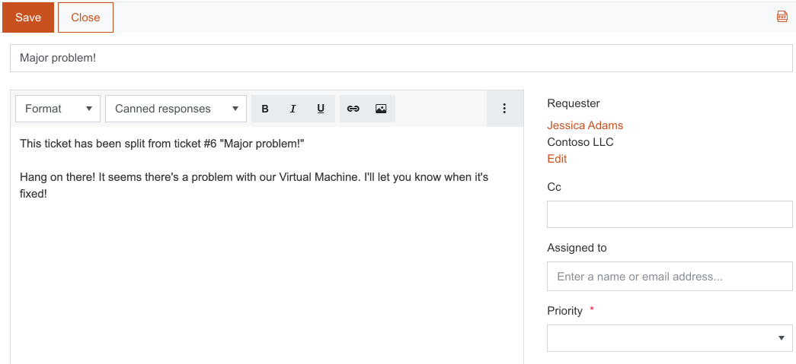

Ticket splitting
################

If one ticket has multiple requests, you can split that ticket into two.
 
For splitting, just open the ticket, choose the comment and click on the button in the top right corner of the comment. Every comment in the ticket has a split button, thus you can make new tickets from any comment unlimited amount of time.

|Splitting|

When the button is clicked, you will be redirected to a new ticket form with predefined fields from original ticket. In the ticket body will be an additional text which says that this ticket was splitted.
Agents can change ticket’s body, its title, and fields. Click **Save** and the new ticket is created.

|SplittedTicket|

.. |Splitting| image:: ../_static/img/split-feature.png
   :alt: Splitting

