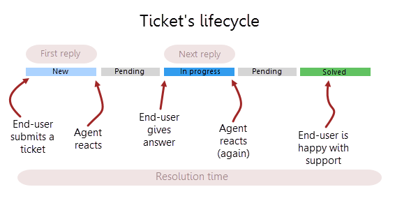

Ticket management
#################

View ticket
~~~~~~~~~~~

You can open up a ticket by clicking its title. You will see a form like this one:

|view-ticket-form|

You can see the Discussion tab with the conversation between the agent and
the requester. You may notice a small lock underneath an agent’s name, it
tells that this message is a private note that is visible to agents only
and not to the requester. The requester will not receive any
notification about it and will not be able to read it. Also, there is a
list of attachments on the right side of the view, below Tags.

The ticket's change history can be opened by clicking the History tab:

|history-tab|

Once you opened the ticket form as the assignee, it is marked as read.
But certainly, you may want to mark the ticket as unread back again. 
To do this, select the ticket you want to mark and click on **Mark as Unread** 
 button.Note that only the ticket assignee can mark a ticket as

|unread-button|

To search for a ticket with a given ID, just type the ID in the **Search tickets** field and hit Enter. 

|search|

Most of the ticket fields are displayed in the table on the right-hand side of the screen:

Requester
   The person from the Contacts list who requested the ticket
   (if the contact has his organization specified you’ll see it next to
   his name).

Assigned to
   The SharePoint user that is currently working on the
   ticket.

Cc
   Contacts specified in this field will receive the
   same notifications as the requester.

Status
   The ticket status. There are four statuses by default: New, In
   progress, Pending and Solved. You can also add your own.

Priority
   Relative ticket priority (Low, Normal, High, Urgent).

Due date
   The date when the ticket has to be resolved by.

Category
   The type of the ticket (Question, Incident, Problem, Request)

Tags
   Some key categories to classify the ticket.

Edit ticket and add comments
~~~~~~~~~~~~~~~~~~~~~~~~~~~~

To open the ticket for edit from a display form click the “Edit Item”
button on the top:

|edit|

Alternatively, you can open a ticket in edit mode from a list of tickets. 
Click on the appropriate button in the context menu:

|edit-ticket-button|

To add a reply or a private note click the “Add reply” or “Add private
note” button and you’ll get to the edit form, where you can enter your
message. Click save and your comment will be added.

|ticket-edit-comment|

Add new ticket
~~~~~~~~~~~~~~

HelpDesk can create new tickets from email messages, but you may
need to create a new ticket manually. Click the button on top of the page:

|new-icon|

When creating a new ticket Title, Requester and Priority fields
are required to be filled in. Status of the ticket will be 'New' by design.

|new-ticket-form|

Assign to me button
~~~~~~~~~~~~~~~~~~~

Assign to me button gives you opportunity to easily assign Tickets to yourself with one click.
To assign tickets, choose one or several unassigned tickets. Then click on Helpdesk tab and select “Assign to me”. 
After that, you will find newly assigned tickets on My tickets tab. This action can be reverted. 
If the ticket has been assigned to somebody else, you can reassign it with Assign to me button as well.

|AssignToMe|

Understanding ticket's statuses
~~~~~~~~~~~~~~~~~~~~~~~~~~~~~~~

In HelpDesk you have four built-in statuses: New, In progress, Pending and Solved. Each of them describes on 
which stage of resolving is the ticket placed.

|TicketLifecycle|

Statuses **New** and **In Progress** are used for calculations of agent’s work time and resolution time of the ticket. 
These calculations are needed for metrics ‘First reply time’ and ‘Next reply time’ in `SLA policies`_. SLA is always 
on pause when the ticket’s status is Pending.
When End-user submits a ticket, ticket’s status will be New by default. It applies to tickets created by team members 
via HelpDesk interface as well.
Then Agent should provide a reply and change ticket’s status to **Pending**. After End-user has provided some feedback, 
ticket’s status will be automatically changed into In progress. This cycle can repeat as much as needed to resolve a 
ticket.
When the ticket is resolved, Agent should change its status to **Solved**.

.. _SLA policies: https://plumsail.com/docs/help-desk-o365/v1.x/Configuration%20Guide/SLA%20policy.html